# Frontmatter Usage

"Frontmatter" is a YAML block at the top of your `.md` files that allows you to set metadata for each page.

**Main Fields:**

```mermaid
graph TD
    subgraph "Frontmatter v1.0"
        A["&#96;title&#96;<br>(Required)"] --> B["&#96;author&#96;<br>(Optional)"]
        B --> C["&#96;date&#96;<br>(Optional)"]
        C --> D["&#96;position&#96;<br>(Optional)"]
        D --> E["&#96;hidden&#96;<br>(Optional)"]
    end
```



- `title`: (Required) The main title of the page.
- `author`: (Optional) The content's author.
- `date`: (Optional) The publication date (`YYYY-MM-DD`).
- `position`: (Optional) A number to sort pages in the sidebar.
- `folder_position`: (Optional) Sorts folders in the sidebar (used in `index.md`).
- `hide_title`: (Optional) `true` to hide the main `<h1>`.
- `hidden`: (Optional) `true` to hide the page from navigation and search.

**Example:**
```yaml
---
title: "My Page"
position: 2
author: "Author"
date: "2024-01-01"
---

Page content...
```