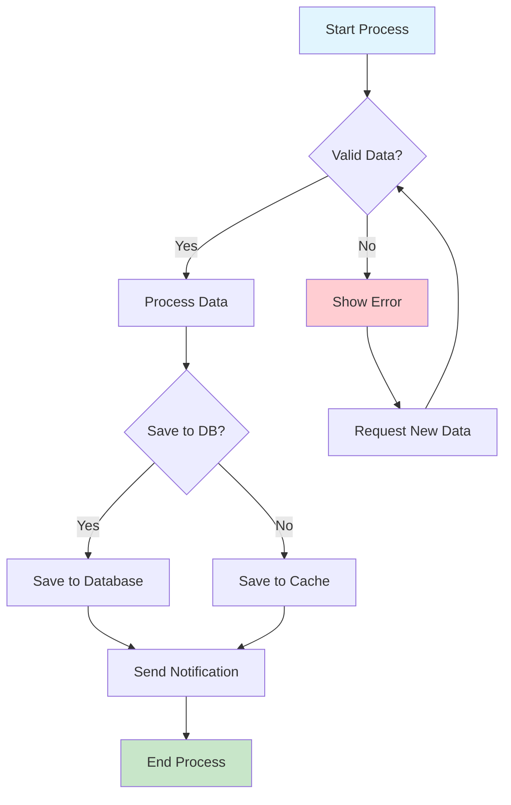
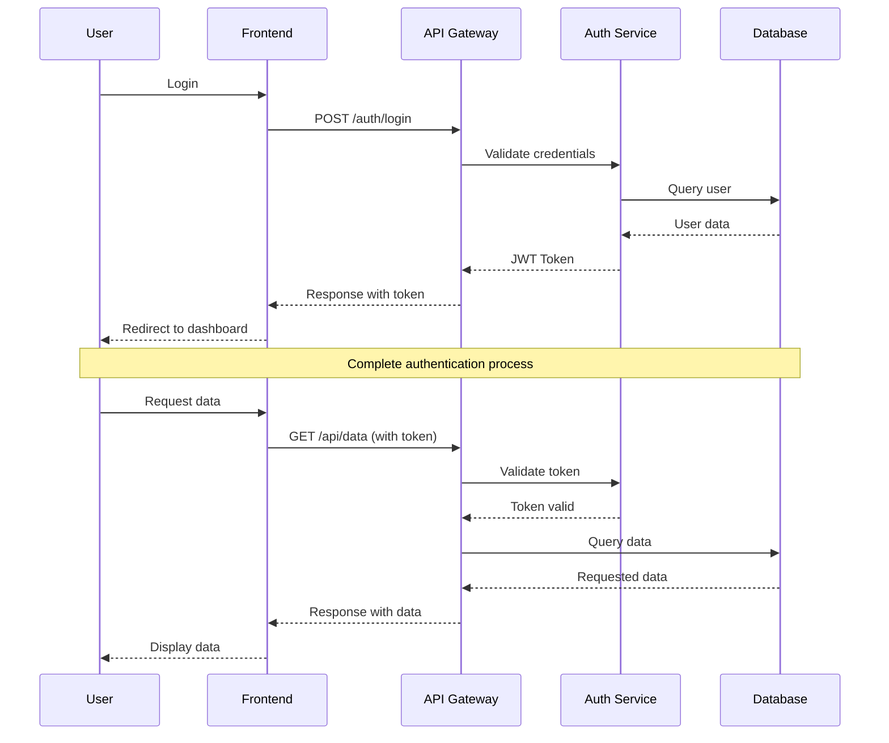
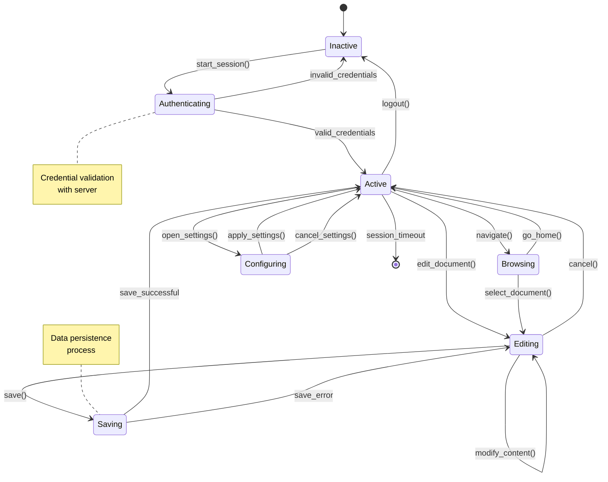
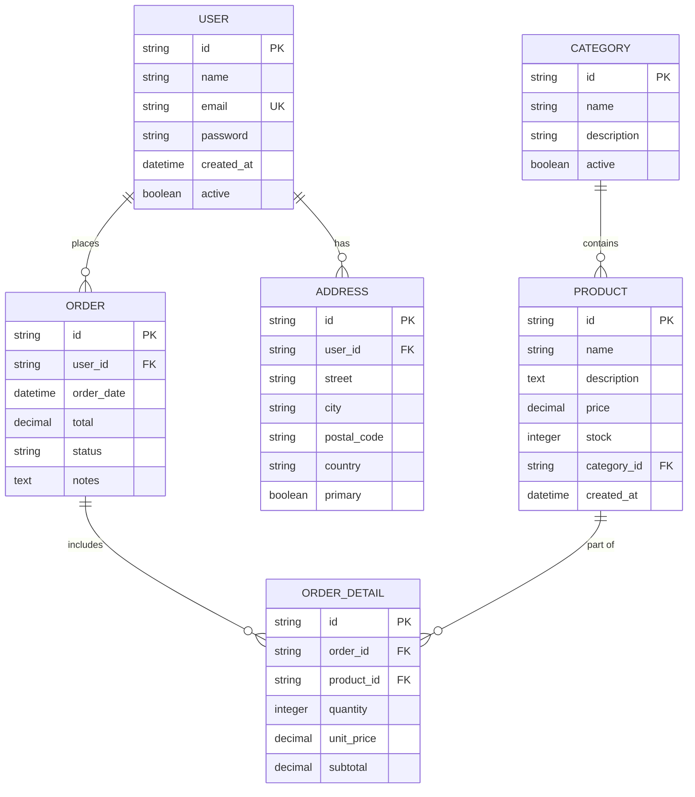
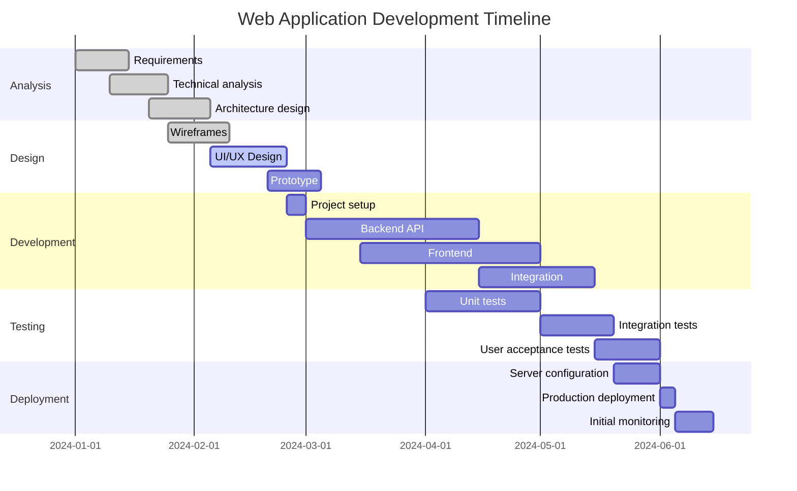
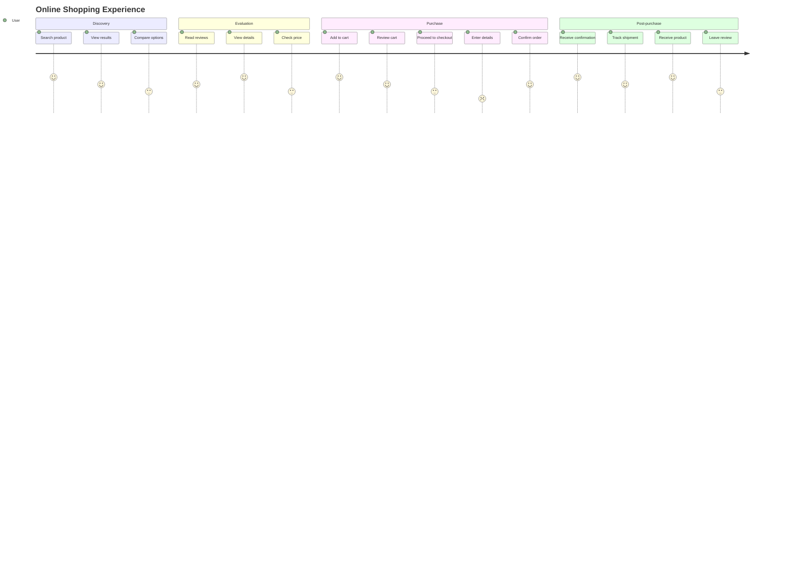
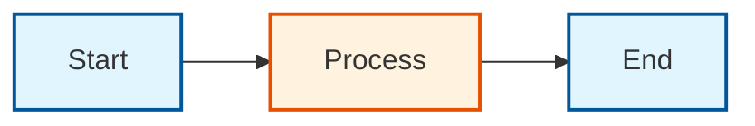

# Mermaid Diagrams - Advanced Examples

Mermaid is a powerful tool for creating diagrams and charts from text. Here you'll find comprehensive examples of different diagram types.

## Component Features

Our Mermaid component includes:

- **Dynamic loading**: Library loads only when needed
- **Theme support**: Automatic adaptation to dark/light mode
- **Unique IDs**: Safe identifier generation to avoid conflicts
- **Error handling**: Clear visualization of rendering errors
- **Responsive**: Automatic adaptation to different screen sizes

## Flowchart

Perfect for representing processes and workflows.

````markdown

````

**Result:**


## Sequence Diagram

Ideal for showing interactions between different actors or systems.

````markdown

````

**Result:**


## Class Diagram

Perfect for documenting object-oriented software architecture.

````markdown
```mermaid
classDiagram
    class User {
        -id: string
        -name: string
        -email: string
        -createdAt: Date
        +login(password: string): boolean
        +updateProfile(data: Object): void
        +changePassword(newPassword: string): boolean
    }
    
    class Product {
        -id: string
        -name: string
        -price: number
        -stock: number
        +updateStock(quantity: number): void
        +applyDiscount(percentage: number): void
        +isAvailable(): boolean
    }
    
    class Order {
        -id: string
        -date: Date
        -status: OrderStatus
        -total: number
        +addProduct(product: Product, quantity: number): void
        +calculateTotal(): number
        +process(): void
        +cancel(): void
    }
    
    class OrderStatus {
        <<enumeration>>
        PENDING
        PROCESSING
        SHIPPED
        DELIVERED
        CANCELLED
    }
    
    User ||--o{ Order : places
    Order }o--|| Product : contains
    Order ||--|| OrderStatus : has
```
````

**Result:**
```mermaid
classDiagram
    class User {
        -id: string
        -name: string
        -email: string
        -createdAt: Date
        +login(password: string): boolean
        +updateProfile(data: Object): void
        +changePassword(newPassword: string): boolean
    }
    
    class Product {
        -id: string
        -name: string
        -price: number
        -stock: number
        +updateStock(quantity: number): void
        +applyDiscount(percentage: number): void
        +isAvailable(): boolean
    }
    
    class Order {
        -id: string
        -date: Date
        -status: OrderStatus
        -total: number
        +addProduct(product: Product, quantity: number): void
        +calculateTotal(): number
        +process(): void
        +cancel(): void
    }
    
    class OrderStatus {
        <<enumeration>>
        PENDING
        PROCESSING
        SHIPPED
        DELIVERED
        CANCELLED
    }
    
    User ||--o{ Order : places
    Order }o--|| Product : contains
    Order ||--|| OrderStatus : has
```

## State Diagram

Excellent for modeling system behavior with different states.

````markdown

````

**Result:**


## Entity Relationship Diagram (ER)

Perfect for designing databases and showing relationships between entities.

````markdown

````

**Result:**


## Gantt Chart

Ideal for project planning and schedule management.

````markdown

````

**Result:**


## User Journey Diagram

Perfect for mapping user experience in an application.

````markdown

````

**Result:**


## Tips for Using Mermaid

### Best Practices

1. **Keep it simple**: Don't overload diagrams with too much information
2. **Use consistent colors**: Define a color scheme and stick to it
3. **Add explanatory notes**: Use `note` to clarify complex concepts
4. **Organize information**: Group related elements together
5. **Test readability**: Ensure the diagram is easy to read

### Customization with Styles

You can customize the appearance of your diagrams:

```markdown

```

### Best Practices

#### For Flowcharts
- Use consistent shapes for similar types of elements
- Maintain left-to-right or top-to-bottom flow
- Include clear decision points with descriptive labels

#### For Sequence Diagrams
- Order participants logically
- Use notes to clarify complex behaviors
- Group related interactions together

#### For Class Diagrams
- Keep related classes close to each other
- Use inheritance and composition clearly
- Include only the most important methods and properties

#### General Tips
- Avoid overly complex diagrams; break them into smaller parts
- Use colors consistently to categorize elements
- Test your diagrams on different screen sizes
- Update diagrams when you change the code

### Troubleshooting

#### CSS Selector Error
If you see errors related to invalid CSS selectors, the component now automatically generates unique and valid IDs.

#### Rendering Issues
- Verify Mermaid syntax in the [online editor](https://mermaid.live/)
- Ensure there are no unescaped special characters
- Check that braces and parentheses are balanced

### Additional Resources

- [Official Mermaid Documentation](https://mermaid-js.github.io/mermaid/)
- [Mermaid Live Editor](https://mermaid.live/)
- [Example Gallery](https://mermaid-js.github.io/mermaid/#/examples)
- [Complete Syntax Guide](https://mermaid-js.github.io/mermaid/#/flowchart)