# Uso de Frontmatter

El "frontmatter" es un bloque YAML al principio de tus archivos `.md` que te permite establecer metadatos para cada página.

**Campos Principales:**

```mermaid
graph TD
    subgraph "Frontmatter v1.0"
        A["&#96;title&#96;<br>(Obligatorio)"] --> B["&#96;author&#96;<br>(Opcional)"]
        B --> C["&#96;date&#96;<br>(Opcional)"]
        C --> D["&#96;position&#96;<br>(Opcional)"]
        D --> E["&#96;hidden&#96;<br>(Opcional)"]
    end
```



- `title`: (Obligatorio) El título principal de la página.
- `author`: (Opcional) El autor del contenido.
- `date`: (Opcional) La fecha de publicación (`YYYY-MM-DD`).
- `position`: (Opcional) Un número para ordenar las páginas en la barra lateral.
- `folder_position`: (Opcional) Ordena las carpetas en la barra lateral (usado en `index.md`).
- `hide_title`: (Opcional) `true` para ocultar el `<h1>` principal.
- `hidden`: (Opcional) `true` para ocultar la página de la navegación y la búsqueda.

**Ejemplo:**
```yaml
---
title: "Mi Página"
position: 2
author: "Autor"
date: "2024-01-01"
---

Contenido de la página...
```