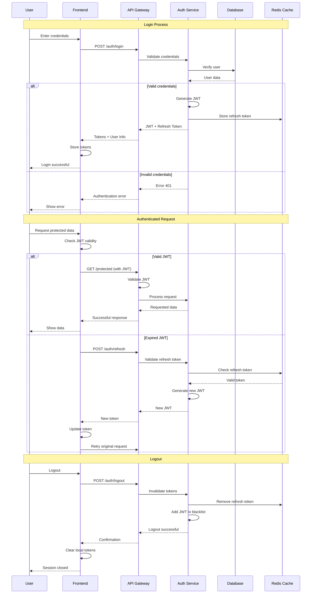
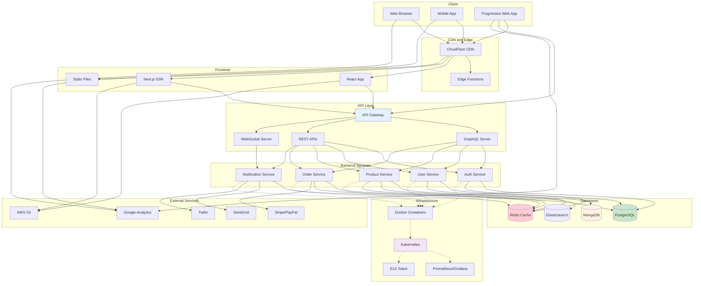
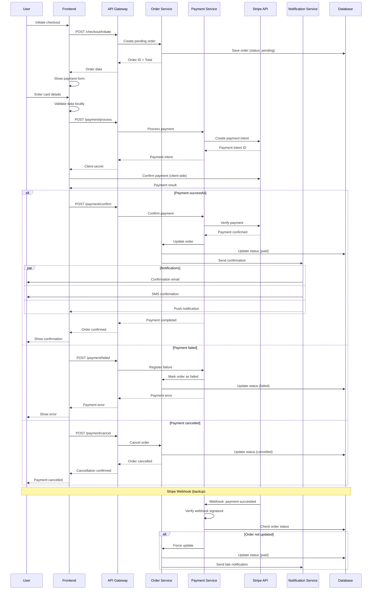
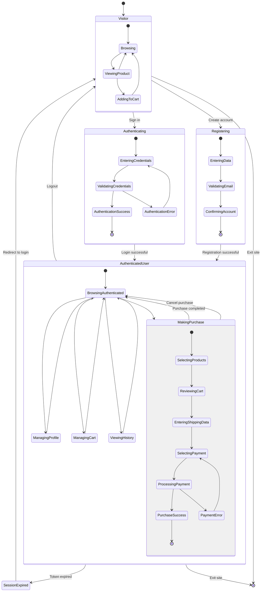

# Diagrams for Web Development and APIs

Specific examples of Mermaid diagrams for documenting REST APIs, web architectures, and authentication flows.

## REST API - Endpoints and Resources

Diagram showing the structure of a REST API.

````markdown
```mermaid
flowchart TD
    subgraph "REST API - E-commerce"
        BASE[/api/v1]
    end
    
    subgraph "Authentication"
        AUTH[/auth]
        LOGIN[/auth/login]
        REGISTER[/auth/register]
        REFRESH[/auth/refresh]
        LOGOUT[/auth/logout]
    end
    
    subgraph "Users"
        USERS[/users]
        USER_ID[/users/:id]
        USER_PROFILE[/users/:id/profile]
        USER_ORDERS[/users/:id/orders]
    end
    
    subgraph "Products"
        PRODUCTS[/products]
        PRODUCT_ID[/products/:id]
        PRODUCT_REVIEWS[/products/:id/reviews]
        CATEGORIES[/categories]
        SEARCH[/products/search]
    end
    
    subgraph "Cart and Orders"
        CART[/cart]
        CART_ITEMS[/cart/items]
        ORDERS[/orders]
        ORDER_ID[/orders/:id]
        CHECKOUT[/checkout]
    end
    
    subgraph "Administration"
        ADMIN[/admin]
        ADMIN_USERS[/admin/users]
        ADMIN_PRODUCTS[/admin/products]
        ADMIN_ORDERS[/admin/orders]
        ANALYTICS[/admin/analytics]
    end
    
    BASE --> AUTH
    BASE --> USERS
    BASE --> PRODUCTS
    BASE --> CART
    BASE --> ORDERS
    BASE --> ADMIN
    
    AUTH --> LOGIN
    AUTH --> REGISTER
    AUTH --> REFRESH
    AUTH --> LOGOUT
    
    USERS --> USER_ID
    USER_ID --> USER_PROFILE
    USER_ID --> USER_ORDERS
    
    PRODUCTS --> PRODUCT_ID
    PRODUCTS --> CATEGORIES
    PRODUCTS --> SEARCH
    PRODUCT_ID --> PRODUCT_REVIEWS
    
    CART --> CART_ITEMS
    ORDERS --> ORDER_ID
    ORDERS --> CHECKOUT
    
    ADMIN --> ADMIN_USERS
    ADMIN --> ADMIN_PRODUCTS
    ADMIN --> ADMIN_ORDERS
    ADMIN --> ANALYTICS
    
    style BASE fill:#e3f2fd
    style AUTH fill:#fff3e0
    style USERS fill:#f3e5f5
    style PRODUCTS fill:#e8f5e8
    style CART fill:#fff8e1
    style ORDERS fill:#fce4ec
    style ADMIN fill:#ffebee
```
````

**Result:**
```mermaid
flowchart TD
    subgraph "REST API - E-commerce"
        BASE[/api/v1]
    end
    
    subgraph "Authentication"
        AUTH[/auth]
        LOGIN[/auth/login]
        REGISTER[/auth/register]
        REFRESH[/auth/refresh]
        LOGOUT[/auth/logout]
    end
    
    subgraph "Users"
        USERS[/users]
        USER_ID[/users/:id]
        USER_PROFILE[/users/:id/profile]
        USER_ORDERS[/users/:id/orders]
    end
    
    subgraph "Products"
        PRODUCTS[/products]
        PRODUCT_ID[/products/:id]
        PRODUCT_REVIEWS[/products/:id/reviews]
        CATEGORIES[/categories]
        SEARCH[/products/search]
    end
    
    subgraph "Cart and Orders"
        CART[/cart]
        CART_ITEMS[/cart/items]
        ORDERS[/orders]
        ORDER_ID[/orders/:id]
        CHECKOUT[/checkout]
    end
    
    subgraph "Administration"
        ADMIN[/admin]
        ADMIN_USERS[/admin/users]
        ADMIN_PRODUCTS[/admin/products]
        ADMIN_ORDERS[/admin/orders]
        ANALYTICS[/admin/analytics]
    end
    
    BASE --> AUTH
    BASE --> USERS
    BASE --> PRODUCTS
    BASE --> CART
    BASE --> ORDERS
    BASE --> ADMIN
    
    AUTH --> LOGIN
    AUTH --> REGISTER
    AUTH --> REFRESH
    AUTH --> LOGOUT
    
    USERS --> USER_ID
    USER_ID --> USER_PROFILE
    USER_ID --> USER_ORDERS
    
    PRODUCTS --> PRODUCT_ID
    PRODUCTS --> CATEGORIES
    PRODUCTS --> SEARCH
    PRODUCT_ID --> PRODUCT_REVIEWS
    
    CART --> CART_ITEMS
    ORDERS --> ORDER_ID
    ORDERS --> CHECKOUT
    
    ADMIN --> ADMIN_USERS
    ADMIN --> ADMIN_PRODUCTS
    ADMIN --> ADMIN_ORDERS
    ADMIN --> ANALYTICS
    
    style BASE fill:#e3f2fd
    style AUTH fill:#fff3e0
    style USERS fill:#f3e5f5
    style PRODUCTS fill:#e8f5e8
    style CART fill:#fff8e1
    style ORDERS fill:#fce4ec
    style ADMIN fill:#ffebee
```

## JWT Authentication Flow

Complete authentication process with JSON Web Tokens.

````markdown

````

**Result:**


## Modern Web Application Architecture

Complete structure of a web application with frontend, backend, and services.

````markdown

````

**Result:**


## Payment Processing Flow

Complete online payment process with validations and confirmations.

````markdown

````

**Result:**


## Web Application State Diagram

State diagram for user session lifecycle in a web application.

````markdown

````

**Result:**


## Best Practices for APIs

### Endpoint Documentation
- Use flowcharts to show API structure
- Include HTTP status codes in sequence diagrams
- Document error flows and exception handling

### Authentication and Security
- Clearly show authentication flows
- Include validations and security checkpoints
- Document token and session handling

### Service Architecture
- Clearly separate responsibilities of each service
- Show dependencies between services
- Include communication patterns (sync/async)

### Monitoring and Observability
- Include logging and metrics points
- Document error and recovery flows
- Show integrations with monitoring tools