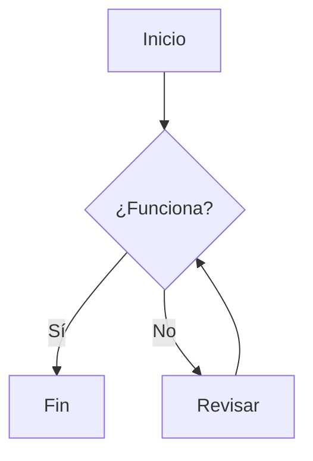

# Componentes de Visualización de Datos

Estos componentes están diseñados para presentar información de manera estructurada y visualmente atractiva.

## Diagramas (Mermaid)

Renderiza diagramas y flujogramas a partir de texto utilizando la sintaxis de [Mermaid JS](https://mermaid.js.org/).

**Sintaxis:**
````markdown

````
**Resultado:**


## Línea de Tiempo (Timeline)

Muestra una secuencia de eventos en orden cronológico.

**Sintaxis:**
````markdown
```timeline
### Título del Evento 1 | 24 de Mayo, 2024
Contenido del primer evento.

---

### Título del Evento 2 | 25 de Mayo, 2024
Contenido del segundo evento.
```
````
**Resultado:**
```timeline
### Título del Evento 1 | 24 de Mayo, 2024
Contenido del primer evento.

---

### Título del Evento 2 | 25 de Mayo, 2024
Contenido del segundo evento.
```

## Tarjetas (Cards)

Crea una cuadrícula de tarjetas enlazables, ideales para mostrar características o enlazar a otras secciones.

**Sintaxis:**
````markdown
```cards
---
columns: 2
items:
  - title: "Característica Uno"
    icon: "RocketIcon"
    href: "/ruta/a/la/pagina"
    content: "Una breve descripción de la primera característica."
  - title: "Característica Dos"
    icon: "BookOpenIcon"
    href: "/ruta/a/otra/pagina"
    content: "Una breve descripción de la segunda característica."
---
```
````
**Resultado:**
```cards
---
columns: 2
items:
  - title: "Característica Uno"
    icon: "RocketIcon"
    href: "#"
    content: "Una breve descripción de la primera característica."
  - title: "Característica Dos"
    icon: "BookOpenIcon"
    href: "#"
    content: "Una breve descripción de la segunda característica."
---
```

## Pasos (Steps)

Guía a los usuarios a través de un proceso con una lista numerada y visual.

**Sintaxis:**
````markdown
```steps
### Primer Paso
Contenido que describe el primer paso del proceso.

### Segundo Paso
Contenido que describe el segundo paso.

### Tercer Paso
Y así sucesivamente...
```
````
**Resultado:**
```steps
### Primer Paso
Contenido que describe el primer paso del proceso.

### Segundo Paso
Contenido que describe el segundo paso.

### Tercer Paso
Y así sucesivamente...
```

## Árbol de Archivos (File Tree)

Muestra una estructura de directorios y archivos, útil para proyectos de software.

**Sintaxis:**
````markdown
```file-tree
---
highlight:
  - "src/components/"
annotations:
  "package.json": "Define las dependencias"
---
project-root/
├── src/
│   ├── components/
│   │   └── Button.tsx
│   └── index.tsx
├── package.json
└── README.md
```
````
**Resultado:**
```file-tree
---
highlight:
  - "src/components/"
annotations:
  "package.json": "Define las dependencias"
---
project-root/
├── src/
│   ├── components/
│   │   └── Button.tsx
│   └── index.tsx
├── package.json
└── README.md
```

## Perfil de Equipo (Team Profile)

Muestra a los miembros de tu equipo con avatares, roles y enlaces sociales.

**Sintaxis:**
````markdown
```team-profile
---
columns: 3
members:
  - name: "Jane Doe"
    role: "Frontend Developer"
    avatar: "https://images.unsplash.com/photo-1573496359142-b8d87734a5a2?q=80&w=150&h=150&fit=crop"
    bio: "Experta en React y Tailwind CSS."
    social:
      - icon: "Twitter"
        url: "#"
      - icon: "GitHub"
        url: "#"
---
```
````
**Resultado:**
```team-profile
---
columns: 3
members:
  - name: "Jane Doe"
    role: "Frontend Developer"
    avatar: "https://images.unsplash.com/photo-1573496359142-b8d87734a5a2?q=80&w=150&h=150&fit=crop"
    bio: "Experta en React y Tailwind CSS."
    social:
      - icon: "Twitter"
        url: "#"
      - icon: "GitHub"
        url: "#"
  - name: "John Smith"
    role: "Backend Developer"
    avatar: "https://images.unsplash.com/photo-1560250097-0b93528c311a?q=80&w=150&h=150&fit=crop"
    bio: "Especialista en Node.js y bases de datos."
    social:
      - icon: "LinkedIn"
        url: "#"
---
```

## Lista de Características (Feature List)

Presenta una lista de características clave con iconos y descripciones.

**Sintaxis:**
````markdown
```feature-list
---
items:
  - icon: "BoltIcon"
    title: "Rendimiento Rápido"
    content: "Optimizado para una carga y navegación ultra rápidas."
  - icon: "ShieldCheckIcon"
    title: "Seguro y Confiable"
    content: "Construido con las mejores prácticas de seguridad."
---
```
````
**Resultado:**
```feature-list
---
items:
  - icon: "BoltIcon"
    title: "Rendimiento Rápido"
    content: "Optimizado para una carga y navegación ultra rápidas."
  - icon: "ShieldCheckIcon"
    title: "Seguro y Confiable"
    content: "Construido con las mejores prácticas de seguridad."
---
```

## Tabla Comparativa (Comparison Table)

Compara características entre diferentes productos o planes.

**Sintaxis:**
````markdown
```comparison-table
---
headers:
  - "Característica"
  - { text: "Plan Básico", highlight: false }
  - { text: "Plan Pro", highlight: true }
rows:
  - ["Usuarios", "1", "10"]
  - ["Soporte", "check", "check"]
  - ["API", "cross", "check"]
  - ["Dominio Personalizado", "no", "yes"]
---
```
````
**Resultado:**
```comparison-table
---
headers:
  - "Característica"
  - { text: "Plan Básico", highlight: false }
  - { text: "Plan Pro", highlight: true }
rows:
  - ["Usuarios", "1", "10"]
  - ["Soporte", "check", "check"]
  - ["API", "cross", "check"]
  - ["Dominio Personalizado", "no", "yes"]
---
```

## Tarjetas de Estadísticas (Stat Cards)

Muestra métricas o KPIs clave de una manera visualmente impactante.

**Sintaxis:**
````markdown
```stat-cards
---
columns: 4
items:
  - icon: "DownloadIcon"
    value: "1.2M"
    label: "Descargas"
    color: "blue"
  - icon: "UsersIcon"
    value: "50K+"
    label: "Usuarios Activos"
    color: "green"
---
```
````
**Resultado:**
```stat-cards
---
columns: 4
items:
  - icon: "DownloadIcon"
    value: "1.2M"
    label: "Descargas"
    color: "blue"
  - icon: "UsersIcon"
    value: "50K+"
    label: "Usuarios Activos"
    color: "green"
  - icon: "ServerIcon"
    value: "99.9%"
    label: "Uptime"
    color: "teal"
  - icon: "TrendingUpIcon"
    value: "+15%"
    label: "Crecimiento"
    color: "purple"
---
```

## Gráficos (Charts)

Renderiza gráficos usando Chart.js directamente desde tu Markdown.

**Sintaxis:**
````markdown
```charts
---
type: 'bar'
title: 'Ventas por Trimestre'
data:
  labels: ['Q1', 'Q2', 'Q3', 'Q4']
  datasets:
    - label: 'Ventas (en millones)'
      data: [12, 19, 3, 5]
---
```
````
**Resultado:**
```charts
---
type: 'bar'
title: 'Ventas por Trimestre'
data:
  labels: ['Q1', 'Q2', 'Q3', 'Q4']
  datasets:
    - label: 'Ventas (en millones)'
      data: [12, 19, 3, 5]
---
```