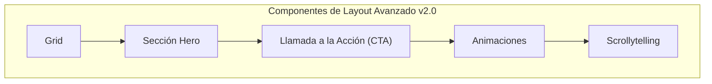

# Componentes de Layout Avanzado

Estos componentes te ayudan a crear páginas visualmente impactantes, narrativas complejas y diseños flexibles.



## Grid

Crea un diseño de cuadrícula flexible para organizar cualquier tipo de contenido. Es perfecto para mostrar elementos uno al lado del otro.

**Sintaxis:**

````markdown
```grid
---
columns: 3 # Puedes usar 2, 3 o 4 columnas
---
### Columna 1
Este es el contenido de la primera columna. Puede ser cualquier **Markdown**.

---

### Columna 2
Este es el contenido de la segunda columna.

---

### Columna 3
Contenido de la tercera columna. Puedes incluir imágenes, listas, etc.
```
````

**Resultado:**

```grid
---
columns: 3
---
#### Tarjeta de Característica 1
- **Fácil de usar:** Sintaxis simple.
- **Flexible:** Soporta múltiples columnas.

---

#### Tarjeta de Característica 2
- **Anidable:** Se puede usar dentro de otros componentes.
- **Responsivo:** Se adapta a diferentes tamaños de pantalla.

---

#### Tarjeta de Característica 3
- **Potente:** Ideal para crear diseños complejos de forma rápida.
- **Versátil:** Combínalo con tarjetas, imágenes o texto.
```

## Sección Hero (Hero Section)

Crea una cabecera de página impresionante con un título grande, subtítulo y botones, sobre una imagen o video de fondo.

**Sintaxis:**

````markdown
```hero-section
---
title: "Título Principal Impactante"
subtitle: "Un subtítulo que describe tu proyecto de manera concisa y atractiva."
backgroundImage: "https://images.unsplash.com/photo-1554147090-e1221a04a025?q=80&w=2070"
overlayOpacity: 0.6
buttons:
  - text: "Empezar"
    url: "#"
    variant: "primary"
    icon: "RocketIcon"
  - text: "Ver en GitHub"
    url: "#"
    variant: "secondary"
---
```
````

**Resultado:**

```hero-section
---
title: "Título Principal Impactante"
subtitle: "Un subtítulo que describe tu proyecto de manera concisa y atractiva."
backgroundImage: "https://images.unsplash.com/photo-1554147090-e1221a04a025?q=80&w=2070"
overlayOpacity: 0.6
buttons:
  - text: "Empezar"
    url: "#"
    variant: "primary"
    icon: "RocketIcon"
  - text: "Ver en GitHub"
    url: "#"
    variant: "secondary"
---
```

## Llamada a la Acción (CTA)

Un bloque diseñado para captar la atención del usuario y dirigirlo a una acción específica.

**Sintaxis:**

````markdown
```cta
---
title: "¿Listo para empezar?"
buttons:
  - text: "Crear una cuenta"
    url: "#"
    variant: "primary"
  - text: "Leer la documentación"
    url: "#"
    variant: "secondary"
---
Este es el contenido principal del CTA. Puedes explicar por qué el usuario debería realizar la acción.
```
````

**Resultado:**

```cta
---
title: "¿Listo para empezar?"
buttons:
  - text: "Crear una cuenta"
    url: "#"
    variant: "primary"
  - text: "Leer la documentación"
    url: "#"
    variant: "secondary"
---
Este es el contenido principal del CTA. Puedes explicar por qué el usuario debería realizar la acción.
```

## Animaciones (Animate)

Aplica animaciones dinámicas a cualquier contenido para añadir un toque visual. La animación se activa cuando el elemento entra en la pantalla. Este componente utiliza la popular librería [Animate.css](https://animate.style/), por lo que puedes usar cualquiera de los nombres de animación que se encuentran en su documentación.

**Sintaxis:**

````markdown
```animate
---
animation: "tada"
duration: "2s"
iteration: "infinite"
---
### ¡Contenido Animado!
Este contenido usará la animación `tada` y se repetirá infinitamente.
```
````

**Resultado:**

```animate
---
animation: "tada"
duration: "2s"
iteration: "infinite"
---
### ¡Contenido Animado!
Este contenido usará la animación `tada` y se repetirá infinitamente.
```

## Scrollytelling

Crea una narrativa visual donde el contenido multimedia en un panel fijo cambia a medida que el usuario se desplaza por los pasos de texto en otro panel.

**Sintaxis:**

````markdown
```scrollytelling
---
steps:
  - media:
      type: image
      src: "https://images.unsplash.com/photo-1504221507732-00163c469521?q=80&w=600&h=400&fit=crop"
      alt: "Escritorio con portátil"
    content: |
      ### El Inicio
      A medida que te desplazas, el panel de la derecha se actualizará.
      Este es el **primer paso**.
  - media:
      type: image
      src: "https://images.unsplash.com/photo-1499951360447-b19be8fe80f5?q=80&w=600&h=400&fit=crop"
      alt: "Otro escritorio con portátil"
    content: |
      ### El Desarrollo
      Ahora estás viendo el **segundo paso**. La imagen ha cambiado para reflejar el contenido.
  - media:
      type: code
      lang: "javascript"
      code: "const x = 'final';"
    content: |
      ### La Conclusión
      El último paso puede incluso mostrar código o diagramas de Mermaid.
---
```
````

**Resultado:**

```scrollytelling
---
steps:
  - media:
      type: image
      src: "https://images.unsplash.com/photo-1504221507732-00163c469521?q=80&w=600&h=400&fit=crop"
      alt: "Escritorio con portátil"
    content: |
      ### El Inicio
      A medida que te desplazas, el panel de la derecha (o inferior en móviles) se actualizará.
      Este es el **primer paso** de nuestra historia.
  - media:
      type: image
      src: "https://images.unsplash.com/photo-1499951360447-b19be8fe80f5?q=80&w=600&h=400&fit=crop"
      alt: "Otro escritorio con portátil"
    content: |
      ### El Desarrollo
      Ahora estás viendo el **segundo paso**. La imagen ha cambiado para reflejar este nuevo punto en la narrativa.
  - media:
      type: code
      lang: "javascript"
      code: "const conclusion = '¡El Scrollytelling es genial!';"
    content: |
      ### La Conclusión
      El último paso puede incluso mostrar fragmentos de código, como este.
---
```