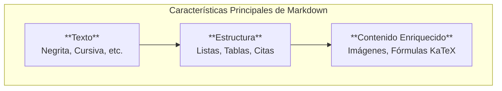

# Guía Completa de Sintaxis Markdown

Esta plataforma soporta la sintaxis estándar de [GitHub Flavored Markdown (GFM)](https://github.github.com/gfm/) y la extiende con características adicionales como fórmulas matemáticas y imágenes personalizables.



## Frontmatter

Cada página puede incluir un bloque de metadatos YAML al principio. Aprende más sobre esto en nuestra [guía de uso de frontmatter](./03-uso-de-frontmatter.md).

## Estilos de Texto

| Estilo | Sintaxis | Ejemplo |
| :--- | :--- | :--- |
| **Negrita** | `**texto**` o `__texto__` | **Texto en negrita** |
| *Cursiva* | `*texto*` o `_texto_` | *Texto en cursiva* |
| ~~Tachado~~ | `~~texto~~` | ~~Texto tachado~~ |
| `Código en línea` | `` `código` `` | `console.log()` |

## Encabezados

```markdown
# Encabezado 1
## Encabezado 2
### Encabezado 3
#### Encabezado 4
```
Los encabezados `##` y `###` aparecen automáticamente en la tabla de contenidos "En esta página".

## Citas

> Esta es una cita. Puede extenderse por varias líneas.
>
> > Las citas también pueden anidarse.

## Listas

### Desordenada
```markdown
* Manzanas
* Naranjas
  * Valenciana
  * Sanguina
* Plátanos
```
* Manzanas
* Naranjas
  * Valenciana
  * Sanguina
* Plátanos

### Ordenada
```markdown
1. Primer paso
2. Segundo paso
3. Tercer paso
```
1. Primer paso
2. Segundo paso
3. Tercer paso

### Lista de Tareas
```markdown
- [x] Tarea completada
- [ ] Tarea pendiente
```
- [x] Tarea completada
- [ ] Tarea pendiente

## Tabla

```markdown
| Alineación Izquierda | Alineación Centro | Alineación Derecha |
| :----------------- | :---------------: | -----------------: |
| Contenido          |     Contenido     |          Contenido |
| Celda              |       Celda       |              Celda |
```
| Alineación Izquierda | Alineación Centro | Alineación Derecha |
| :----------------- | :---------------: | -----------------: |
| Contenido          |     Contenido     |          Contenido |
| Celda              |       Celda       |              Celda |

## Imágenes con Opciones

Las imágenes son interactivas (se abren en un visor) y puedes controlar su apariencia.

```markdown

```


## Fórmulas Matemáticas (KaTeX)

Puedes renderizar expresiones matemáticas usando la sintaxis de LaTeX.

**En línea:** `$E = mc^2$` se renderiza como $E = mc^2$.

**En bloque:**
```markdown
$$
\int_{-\infty}^{\infty} e^{-x^2} dx = \sqrt{\pi}
$$
```
$$
\int_{-\infty}^{\infty} e^{-x^2} dx = \sqrt{\pi}
$$

## Notas al Pie

Las notas al pie son una excelente manera de añadir información adicional o citas.[^1]

Simplemente añade otra referencia para una segunda nota.[^nota-larga]

[^1]: Este es el contenido de la primera nota al pie.
[^nota-larga]: Y este es el contenido de la segunda nota, que puede ser más larga y contener múltiples párrafos.