# Uso de Frontmatter

Cada archivo Markdown en tu sitio de documentación puede contener un bloque de metadatos al principio del archivo, conocido como "frontmatter". Este bloque está escrito en YAML y te permite controlar varios aspectos de cómo se muestra y organiza la página.

El bloque de frontmatter debe estar al principio del archivo, encerrado entre dos líneas de tres guiones (`---`).

## Campos Disponibles

Aquí tienes una lista de todos los campos que puedes usar en el frontmatter:

```mermaid
graph TD
    subgraph "Campos de Frontmatter"
        A("--- (Inicio)") --> B
        B["&#96;title&#96;<br>string, obligatorio"] --> C["&#96;author&#96;<br>string, opcional"]
        C --> D["&#96;date&#96;<br>string, YYYY-MM-DD"]
        D --> E["&#96;position&#96;<br>number, opcional"]
        E --> F["&#96;folder_position&#96;<br>number, opcional"]
        F --> G["&#96;hide_title&#96;<br>boolean, opcional"]
        G --> H["&#96;hidden&#96;<br>boolean, opcional"]
        H --> I("--- (Fin)")
    end
```



---

### `title`
- **Tipo:** `string`
- **Obligatorio:** Sí
- **Descripción:** El título principal de la página. Se mostrará como el encabezado `<h1>` en la parte superior del contenido y se usará en la barra de navegación lateral y en los resultados de búsqueda.

**Ejemplo:**
```yaml
---
title: "Mi Primera Página"
---
```

---

### `author`
- **Tipo:** `string`
- **Obligatorio:** No
- **Descripción:** El nombre del autor de la página. Si se proporciona, se mostrará debajo del título junto con la fecha.

**Ejemplo:**
```yaml
---
title: "Mi Primera Página"
author: "Juan Pérez"
---
```

---

### `date`
- **Tipo:** `string` (formato `YYYY-MM-DD`)
- **Obligatorio:** No
- **Descripción:** La fecha de publicación del documento. Las páginas con una fecha en el futuro no se mostrarán hasta que llegue esa fecha.

**Ejemplo:**
```yaml
---
title: "Anuncio de Lanzamiento"
date: "2024-12-01"
---
```

---

### `position`
- **Tipo:** `number`
- **Obligatorio:** No
- **Descripción:** Un número para controlar el orden de las páginas dentro de una carpeta en la barra de navegación lateral. Las páginas se ordenan primero por `position` (de menor a mayor) y luego alfabéticamente por título.

**Ejemplo:**
```yaml
---
title: "Introducción"
position: 1
---
```

---

### `folder_position`
- **Tipo:** `number`
- **Obligatorio:** No
- **Descripción:** Similar a `position`, pero se usa exclusivamente en un archivo `index.md` para determinar el orden de su carpeta contenedora en la barra de navegación.

**Ejemplo (en `mi-carpeta/index.md`):**
```yaml
---
title: "Título de la Carpeta"
folder_position: 2
---
```

---

### `hide_title`
- **Tipo:** `boolean`
- **Obligatorio:** No
- **Descripción:** Si se establece en `true`, el título principal `<h1>` no se renderizará automáticamente. Esto es útil para páginas que utilizan un componente `hero-section` que ya incluye un título prominente.

**Ejemplo:**
```yaml
---
title: "Página de Inicio"
hide_title: true
---
```

---

### `hidden`
- **Tipo:** `boolean`
- **Obligatorio:** No
- **Descripción:** Si se establece en `true`, la página se ocultará completamente de la navegación (barra lateral principal y secundaria) y no será incluida en los resultados de búsqueda. La página seguirá siendo accesible si se navega directamente a su URL.

**Ejemplo:**
```yaml
---
title: "Página Borrador"
hidden: true
---
```