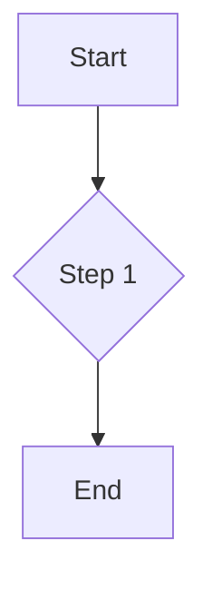

# Data Visualization

Present complex information clearly and attractively.

## Mermaid Diagrams
Render diagrams from text.
````markdown

````
**Result:**


## Timeline
Display events in chronological order.
```timeline
### Milestone 1 | 2023
Description of the first milestone.
---
### Milestone 2 | 2024
Description of the second milestone.
```

## Steps
Guide users through a process.
```steps
### Step 1: Sign Up
Content for the first step.
### Step 2: Configuration
Content for the second step.
```

## Feature List
Highlight a product's key features.
```feature-list
---
items:
  - icon: "BoltIcon"
    title: "Fast"
    content: "Optimized performance."
  - icon: "ShieldCheckIcon"
    title: "Secure"
    content: "Built-in security."
---
```

## Comparison Table
Compare different plans or features.
```comparison-table
---
headers: ["Feature", "Plan A", "Plan B"]
rows:
  - ["API Access", "no", "yes"]
  - ["Support", "check", "check"]
---
```

## Stat Cards
Display key metrics.
```stat-cards
---
columns: 2
items:
  - icon: "UsersIcon"
    value: "10k+"
    label: "Users"
  - icon: "DownloadIcon"
    value: "50k"
    label: "Downloads"
---
```

## Charts
Render charts with Chart.js.
```charts
---
type: 'pie'
title: 'User Distribution'
data:
  labels: ['New', 'Returning']
  datasets:
    - data: [300, 150]
---
```

## Cards

Creates a grid of linkable cards, ideal for showcasing features or linking to other sections.

**Syntax:**
````markdown
```cards
---
columns: 2
items:
  - title: "Feature One"
    icon: "RocketIcon"
    href: "/path/to/page"
    content: "A brief description of the first feature."
  - title: "Feature Two"
    icon: "BookOpenIcon"
    href: "/path/to/another/page"
    content: "A brief description of the second feature."
---
```
````
**Result:**
```cards
---
columns: 2
items:
  - title: "Feature One"
    icon: "RocketIcon"
    href: "#"
    content: "A brief description of the first feature."
  - title: "Feature Two"
    icon: "BookOpenIcon"
    href: "#"
    content: "A brief description of the second feature."
---
```

## File Tree

Displays a directory and file structure, useful for software projects.

**Syntax:**
````markdown
```file-tree
---
highlight:
  - "src/components/"
annotations:
  "package.json": "Defines dependencies"
---
project-root/
├── src/
│   ├── components/
│   │   └── Button.tsx
│   └── index.tsx
├── package.json
└── README.md
```
````
**Result:**
```file-tree
---
highlight:
  - "src/components/"
annotations:
  "package.json": "Defines dependencies"
---
project-root/
├── src/
│   ├── components/
│   │   └── Button.tsx
│   └── index.tsx
├── package.json
└── README.md
```
