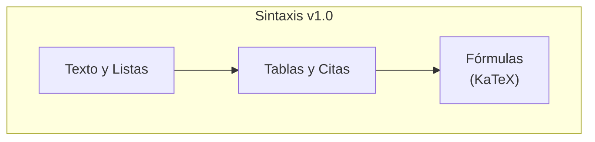

# Guía Completa de Sintaxis Markdown v1.0

Esta plataforma soporta [GitHub Flavored Markdown (GFM)](https://github.github.com/gfm/) y lo amplía con características adicionales.

## Texto y Encabezados

```markdown
# Encabezado 1
## Encabezado 2

**Texto en negrita** y *texto en cursiva*.
~~Texto tachado~~ y `código en línea`.
```

## Listas

**Desordenada:**
* Ítem 1
* Ítem 2

**Ordenada:**
1. Primer ítem
2. Segundo ítem

## Tablas

| Cabecera 1 | Cabecera 2 |
| :--- | :--- |
| Celda 1.1 | Celda 1.2 |
| Celda 2.1 | Celda 2.2 |

## Citas
> Esta es una cita.



## Fórmulas Matemáticas (KaTeX)

Renderiza expresiones LaTeX en línea como $E=mc^2$ o en bloque:
$$
\sum_{i=1}^n i = \frac{n(n+1)}{2}
$$

## Notas al Pie
Puedes añadir notas al pie[^1] para dar información extra.

[^1]: Contenido de la nota al pie.