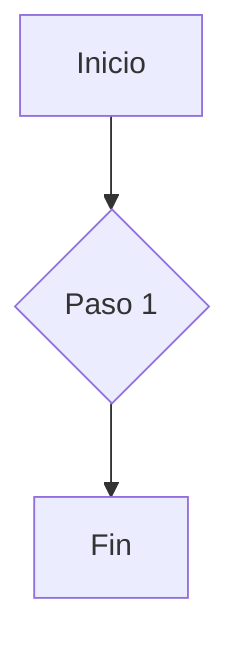

# Visualización de Datos

Presenta información compleja de forma clara y atractiva.

## Diagramas (Mermaid)
Renderiza diagramas a partir de texto.
````markdown

````
**Resultado:**


## Línea de Tiempo
Muestra eventos en orden cronológico.
```timeline
### Hito 1 | 2023
Descripción del primer hito.
---
### Hito 2 | 2024
Descripción del segundo hito.
```

## Pasos
Guía a los usuarios a través de un proceso.
```steps
### Paso 1: Registro
Contenido del primer paso.
### Paso 2: Configuración
Contenido del segundo paso.
```

## Lista de Características
Resalta las características clave de un producto.
```feature-list
---
items:
  - icon: "BoltIcon"
    title: "Rápido"
    content: "Rendimiento optimizado."
  - icon: "ShieldCheckIcon"
    title: "Seguro"
    content: "Seguridad integrada."
---
```

## Tabla Comparativa
Compara diferentes planes o características.
```comparison-table
---
headers: ["Característica", "Plan A", "Plan B"]
rows:
  - ["Acceso API", "no", "yes"]
  - ["Soporte", "check", "check"]
---
```

## Tarjetas de Estadísticas
Muestra métricas clave.
```stat-cards
---
columns: 2
items:
  - icon: "UsersIcon"
    value: "10k+"
    label: "Usuarios"
  - icon: "DownloadIcon"
    value: "50k"
    label: "Descargas"
---
```

## Gráficos
Renderiza gráficos con Chart.js.
```charts
---
type: 'pie'
title: 'Distribución de Usuarios'
data:
  labels: ['Nuevos', ' recurrentes']
  datasets:
    - data: [300, 150]
---
```

## Tarjetas (Cards)

Crea una cuadrícula de tarjetas enlazables, ideales para mostrar características o enlazar a otras secciones.

**Sintaxis:**
````markdown
```cards
---
columns: 2
items:
  - title: "Característica Uno"
    icon: "RocketIcon"
    href: "/ruta/a/la/pagina"
    content: "Una breve descripción de la primera característica."
  - title: "Característica Dos"
    icon: "BookOpenIcon"
    href: "/ruta/a/otra/pagina"
    content: "Una breve descripción de la segunda característica."
---
```
````
**Resultado:**
```cards
---
columns: 2
items:
  - title: "Característica Uno"
    icon: "RocketIcon"
    href: "#"
    content: "Una breve descripción de la primera característica."
  - title: "Característica Dos"
    icon: "BookOpenIcon"
    href: "#"
    content: "Una breve descripción de la segunda característica."
---
```

## Árbol de Archivos (File Tree)

Muestra una estructura de directorios y archivos, útil para proyectos de software.

**Sintaxis:**
````markdown
```file-tree
---
highlight:
  - "src/components/"
annotations:
  "package.json": "Define las dependencias"
---
project-root/
├── src/
│   ├── components/
│   │   └── Button.tsx
│   └── index.tsx
├── package.json
└── README.md
```
````
**Resultado:**
```file-tree
---
highlight:
  - "src/components/"
annotations:
  "package.json": "Define las dependencias"
---
project-root/
├── src/
│   ├── components/
│   │   └── Button.tsx
│   └── index.tsx
├── package.json
└── README.md
```
