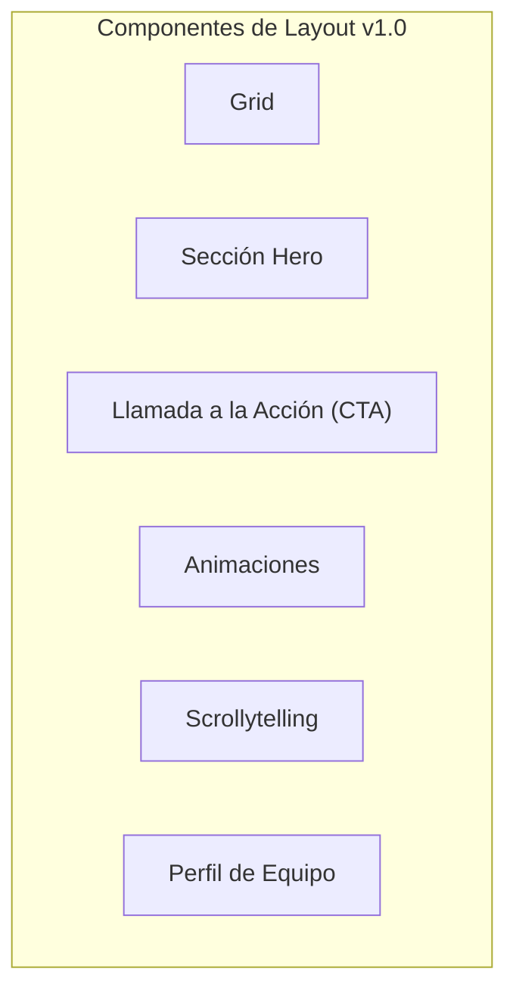

# Layout y Presentación

Crea páginas visualmente atractivas y con estructuras complejas.



## Grid
Organiza contenido en una cuadrícula flexible.
```grid
---
columns: 2
---
### Columna Uno
Contenido para la primera columna.

---

### Columna Dos
Contenido para la segunda columna.
```

## Sección Hero
Una cabecera de página impactante.
```hero-section
---
title: "Mi Proyecto Increíble"
subtitle: "La mejor solución para tus necesidades."
backgroundImage: "https://images.unsplash.com/photo-1554147090-e1221a04a025"
---
```

## Llamada a la Acción (CTA)
Un bloque para dirigir a los usuarios a una acción.
```cta
---
title: "¿Listo para empezar?"
buttons:
  - text: "Regístrate Ahora"
    url: "#"
---
Únete a nuestra plataforma hoy mismo.
```

## Animaciones
Aplica animaciones de [Animate.css](https://animate.style/) al contenido.
```animate
---
animation: "bounceInLeft"
---
¡Este contenido aparecerá rebotando!
```

## Scrollytelling
Una narrativa visual que cambia con el scroll.
```scrollytelling
---
steps:
  - media:
      type: image
      src: "https://images.unsplash.com/photo-1504221507732-00163c469521?q=80&w=600&h=400&fit=crop"
    content: "### El Inicio"
  - media:
      type: image
      src: "https://images.unsplash.com/photo-1499951360447-b19be8fe80f5?q=80&w=600&h=400&fit=crop"
    content: "### El Final"
---
```

## Perfil de Equipo
Muestra a los miembros de tu equipo.
```team-profile
---
columns: 2
members:
  - name: "Jane Doe"
    role: "Developer"
    avatar: "https://images.unsplash.com/photo-1573496359142-b8d87734a5a2?q=80&w=150&h=150&fit=crop"
    bio: "Experta en React."
---
```