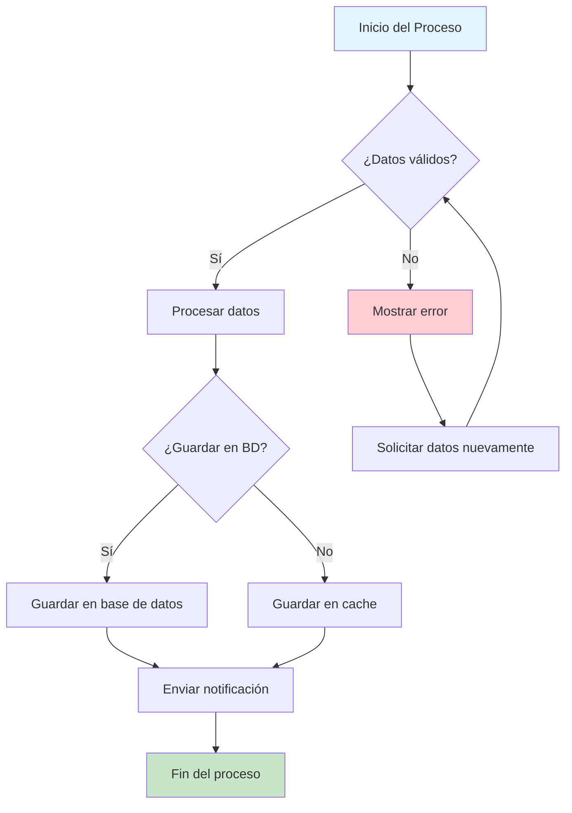
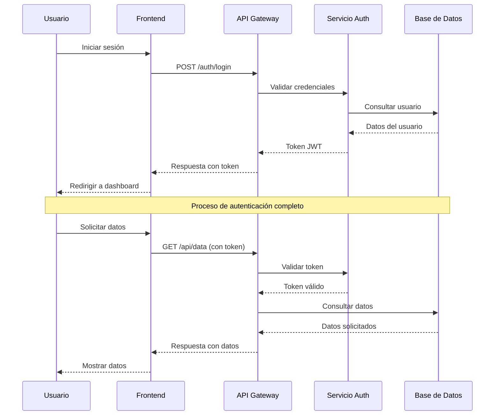
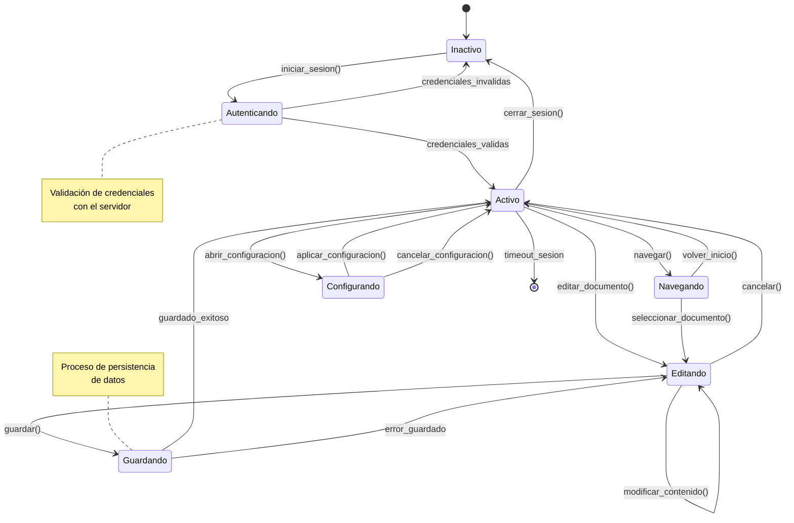
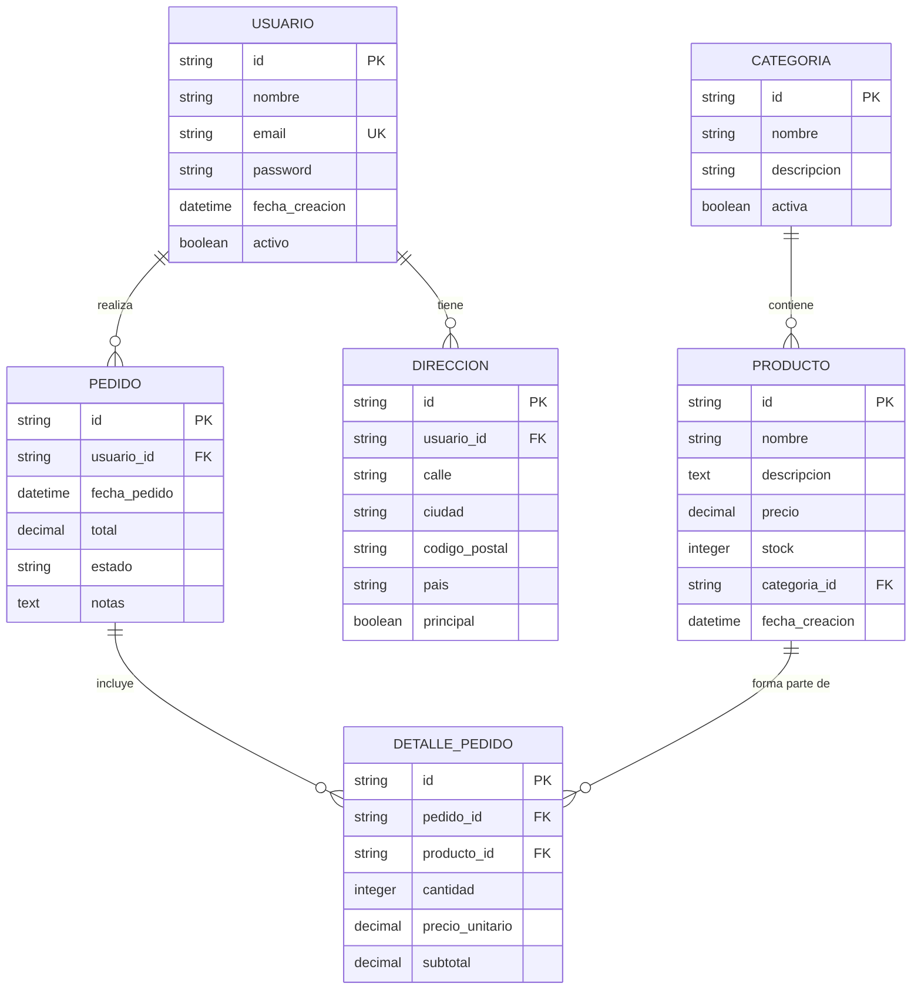
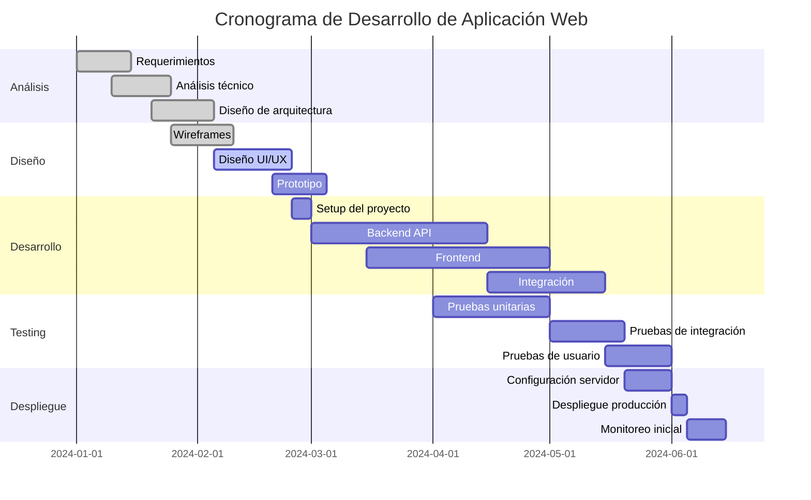
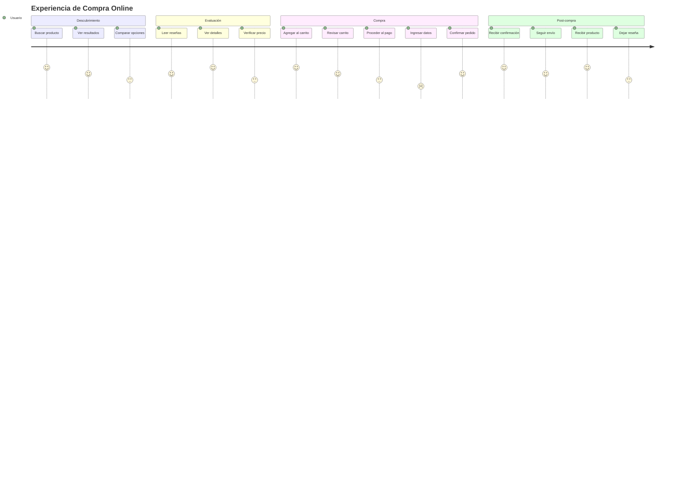
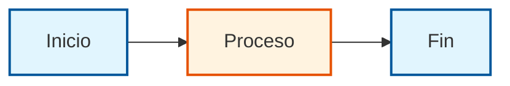

# Diagramas Mermaid - Ejemplos Avanzados

Mermaid es una potente herramienta para crear diagramas y gráficos a partir de texto. Aquí encontrarás ejemplos completos de diferentes tipos de diagramas.

## Características del Componente

Nuestro componente Mermaid incluye:

- **Carga dinámica**: La librería se carga solo cuando es necesaria
- **Soporte para temas**: Adaptación automática al modo oscuro/claro
- **IDs únicos**: Generación segura de identificadores para evitar conflictos
- **Manejo de errores**: Visualización clara de errores de renderizado
- **Responsive**: Adaptación automática a diferentes tamaños de pantalla

## Diagrama de Flujo (Flowchart)

Perfecto para representar procesos y flujos de trabajo.

````markdown

````

**Resultado:**


## Diagrama de Secuencia

Ideal para mostrar interacciones entre diferentes actores o sistemas.

````markdown

````

**Resultado:**


## Diagrama de Clases

Perfecto para documentar la arquitectura de software orientada a objetos.

````markdown
```mermaid
classDiagram
    class Usuario {
        -id: string
        -nombre: string
        -email: string
        -fechaCreacion: Date
        +login(password: string): boolean
        +actualizarPerfil(datos: Object): void
        +cambiarPassword(nueva: string): boolean
    }
    
    class Producto {
        -id: string
        -nombre: string
        -precio: number
        -stock: number
        +actualizarStock(cantidad: number): void
        +aplicarDescuento(porcentaje: number): void
        +estaDisponible(): boolean
    }
    
    class Pedido {
        -id: string
        -fecha: Date
        -estado: EstadoPedido
        -total: number
        +agregarProducto(producto: Producto, cantidad: number): void
        +calcularTotal(): number
        +procesar(): void
        +cancelar(): void
    }
    
    class EstadoPedido {
        <<enumeration>>
        PENDIENTE
        PROCESANDO
        ENVIADO
        ENTREGADO
        CANCELADO
    }
    
    Usuario ||--o{ Pedido : realiza
    Pedido }o--|| Producto : contiene
    Pedido ||--|| EstadoPedido : tiene
```
````

**Resultado:**
```mermaid
classDiagram
    class Usuario {
        -id: string
        -nombre: string
        -email: string
        -fechaCreacion: Date
        +login(password: string): boolean
        +actualizarPerfil(datos: Object): void
        +cambiarPassword(nueva: string): boolean
    }
    
    class Producto {
        -id: string
        -nombre: string
        -precio: number
        -stock: number
        +actualizarStock(cantidad: number): void
        +aplicarDescuento(porcentaje: number): void
        +estaDisponible(): boolean
    }
    
    class Pedido {
        -id: string
        -fecha: Date
        -estado: EstadoPedido
        -total: number
        +agregarProducto(producto: Producto, cantidad: number): void
        +calcularTotal(): number
        +procesar(): void
        +cancelar(): void
    }
    
    class EstadoPedido {
        <<enumeration>>
        PENDIENTE
        PROCESANDO
        ENVIADO
        ENTREGADO
        CANCELADO
    }
    
    Usuario ||--o{ Pedido : realiza
    Pedido }o--|| Producto : contiene
    Pedido ||--|| EstadoPedido : tiene
```

## Diagrama de Estados

Excelente para modelar el comportamiento de sistemas con diferentes estados.

````markdown

````

**Resultado:**


## Diagrama de Entidad-Relación (ER)

Perfecto para diseñar bases de datos y mostrar relaciones entre entidades.

````markdown

````

**Resultado:**


## Diagrama de Gantt

Ideal para planificación de proyectos y gestión de cronogramas.

````markdown

````

**Resultado:**


## Diagrama de Recorrido del Usuario (User Journey)

Perfecto para mapear la experiencia del usuario en una aplicación.

````markdown

````

**Resultado:**


## Consejos para Usar Mermaid

### Mejores Prácticas

1. **Mantén la simplicidad**: No sobrecargues los diagramas con demasiada información
2. **Usa colores consistentes**: Define un esquema de colores y manténlo
3. **Añade notas explicativas**: Usa `note` para aclarar conceptos complejos
4. **Organiza la información**: Agrupa elementos relacionados
5. **Prueba la legibilidad**: Asegúrate de que el diagrama sea fácil de leer

### Personalización con Estilos

Puedes personalizar la apariencia de tus diagramas:

```markdown

```

### Mejores Prácticas

#### Para Diagramas de Flujo
- Usa formas consistentes para tipos similares de elementos
- Mantén el flujo de izquierda a derecha o de arriba hacia abajo
- Incluye puntos de decisión claros con etiquetas descriptivas

#### Para Diagramas de Secuencia
- Ordena los participantes de manera lógica
- Usa notas para aclarar comportamientos complejos
- Agrupa interacciones relacionadas

#### Para Diagramas de Clases
- Mantén las clases relacionadas cerca unas de otras
- Usa herencia y composición de manera clara
- Incluye solo los métodos y propiedades más importantes

#### Consejos Generales
- Evita diagramas demasiado complejos; divídelos en partes más pequeñas
- Usa colores de manera consistente para categorizar elementos
- Prueba tus diagramas en diferentes tamaños de pantalla
- Actualiza los diagramas cuando cambies el código

### Solución de Problemas

#### Error de Selector CSS
Si ves errores relacionados con selectores CSS inválidos, el componente ahora genera automáticamente IDs únicos y válidos.

#### Problemas de Renderizado
- Verifica la sintaxis de Mermaid en el [editor online](https://mermaid.live/)
- Asegúrate de que no hay caracteres especiales no escapados
- Revisa que las llaves y paréntesis estén balanceados

### Recursos Adicionales

- [Documentación oficial de Mermaid](https://mermaid-js.github.io/mermaid/)
- [Editor online de Mermaid](https://mermaid.live/)
- [Galería de ejemplos](https://mermaid-js.github.io/mermaid/#/examples)
- [Guía de sintaxis completa](https://mermaid-js.github.io/mermaid/#/flowchart)