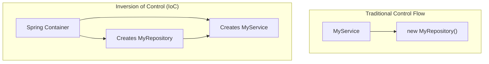

# Session 4: Dependency Injection (DI) & Inversion of Control (IoC)

Two fundamental principles in Spring are Inversion of Control and Dependency Injection.

## Inversion of Control (IoC)

Normally, your code creates and manages the lifecycle of its objects. With IoC, this control is "inverted": the framework (the Spring container) is responsible for creating, configuring, and managing objects.



## Dependency Injection (DI)

DI is the pattern through which IoC is implemented. Instead of an object creating its own dependencies, they are "injected" into it by the Spring container.

### Types of Injection
- **Constructor Injection**: The recommended form. Dependencies are provided through the constructor.
- **Setter Injection**: Dependencies are provided through setter methods.
- **Field Injection**: The simplest, but not recommended for mandatory dependencies.

```java
@Service
public class MyService {

    private final MyRepository repository;

    // Constructor Injection
    @Autowired
    public MyService(MyRepository repository) {
        this.repository = repository;
    }
}
```