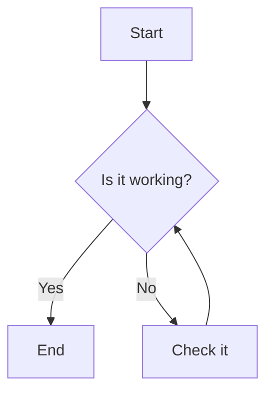

# Data Display Components

These components are designed to present information in a structured and visually appealing way.

## Diagrams (Mermaid)

Renders diagrams and flowcharts from text using [Mermaid JS](https://mermaid.js.org/) syntax.

**Syntax:**
````markdown

````
**Result:**


## Timeline

Displays a sequence of events in chronological order.

**Syntax:**
````markdown
```timeline
### Event Title 1 | May 24, 2024
Content for the first event.

---

### Event Title 2 | May 25, 2024
Content for the second event.
```
````
**Result:**
```timeline
### Event Title 1 | May 24, 2024
Content for the first event.

---

### Event Title 2 | May 25, 2024
Content for the second event.
```

## Cards

Creates a grid of linkable cards, ideal for showcasing features or linking to other sections.

**Syntax:**
````markdown
```cards
---
columns: 2
items:
  - title: "Feature One"
    icon: "RocketIcon"
    href: "/path/to/page"
    content: "A brief description of the first feature."
  - title: "Feature Two"
    icon: "BookOpenIcon"
    href: "/path/to/another/page"
    content: "A brief description of the second feature."
---
```
````
**Result:**
```cards
---
columns: 2
items:
  - title: "Feature One"
    icon: "RocketIcon"
    href: "#"
    content: "A brief description of the first feature."
  - title: "Feature Two"
    icon: "BookOpenIcon"
    href: "#"
    content: "A brief description of the second feature."
---
```

## Steps

Guides users through a process with a visual, numbered list.

**Syntax:**
````markdown
```steps
### First Step
Content describing the first step of the process.

### Second Step
Content describing the second step.

### Third Step
And so on...
```
````
**Result:**
```steps
### First Step
Content describing the first step of the process.

### Second Step
Content describing the second step.

### Third Step
And so on...
```

## File Tree

Displays a directory and file structure, useful for software projects.

**Syntax:**
````markdown
```file-tree
---
highlight:
  - "src/components/"
annotations:
  "package.json": "Defines dependencies"
---
project-root/
├── src/
│   ├── components/
│   │   └── Button.tsx
│   └── index.tsx
├── package.json
└── README.md
```
````
**Result:**
```file-tree
---
highlight:
  - "src/components/"
annotations:
  "package.json": "Defines dependencies"
---
project-root/
├── src/
│   ├── components/
│   │   └── Button.tsx
│   └── index.tsx
├── package.json
└── README.md
```

## Team Profile

Showcases your team members with avatars, roles, and social links.

**Syntax:**
````markdown
```team-profile
---
columns: 3
members:
  - name: "Jane Doe"
    role: "Frontend Developer"
    avatar: "https://images.unsplash.com/photo-1573496359142-b8d87734a5a2?q=80&w=150&h=150&fit=crop"
    bio: "Expert in React and Tailwind CSS."
    social:
      - icon: "Twitter"
        url: "#"
      - icon: "GitHub"
        url: "#"
---
```
````
**Result:**
```team-profile
---
columns: 3
members:
  - name: "Jane Doe"
    role: "Frontend Developer"
    avatar: "https://images.unsplash.com/photo-1573496359142-b8d87734a5a2?q=80&w=150&h=150&fit=crop"
    bio: "Expert in React and Tailwind CSS."
    social:
      - icon: "Twitter"
        url: "#"
      - icon: "GitHub"
        url: "#"
  - name: "John Smith"
    role: "Backend Developer"
    avatar: "https://images.unsplash.com/photo-1560250097-0b93528c311a?q=80&w=150&h=150&fit=crop"
    bio: "Specialist in Node.js and databases."
    social:
      - icon: "LinkedIn"
        url: "#"
---
```

## Feature List

Presents a list of key features with icons and descriptions.

**Syntax:**
````markdown
```feature-list
---
items:
  - icon: "BoltIcon"
    title: "Fast Performance"
    content: "Optimized for ultra-fast loading and navigation."
  - icon: "ShieldCheckIcon"
    title: "Secure and Reliable"
    content: "Built with the best security practices."
---
```
````
**Result:**
```feature-list
---
items:
  - icon: "BoltIcon"
    title: "Fast Performance"
    content: "Optimized for ultra-fast loading and navigation."
  - icon: "ShieldCheckIcon"
    title: "Secure and Reliable"
    content: "Built with the best security practices."
---
```

## Comparison Table

Compares features across different products or plans.

**Syntax:**
````markdown
```comparison-table
---
headers:
  - "Feature"
  - { text: "Basic Plan", highlight: false }
  - { text: "Pro Plan", highlight: true }
rows:
  - ["Users", "1", "10"]
  - ["Support", "check", "check"]
  - ["API Access", "cross", "check"]
  - ["Custom Domain", "no", "yes"]
---
```
````
**Result:**
```comparison-table
---
headers:
  - "Feature"
  - { text: "Basic Plan", highlight: false }
  - { text: "Pro Plan", highlight: true }
rows:
  - ["Users", "1", "10"]
  - ["Support", "check", "check"]
  - ["API Access", "cross", "check"]
  - ["Custom Domain", "no", "yes"]
---
```

## Stat Cards

Displays key metrics or KPIs in a visually impactful way.

**Syntax:**
````markdown
```stat-cards
---
columns: 4
items:
  - icon: "DownloadIcon"
    value: "1.2M"
    label: "Downloads"
    color: "blue"
  - icon: "UsersIcon"
    value: "50K+"
    label: "Active Users"
    color: "green"
---
```
````
**Result:**
```stat-cards
---
columns: 4
items:
  - icon: "DownloadIcon"
    value: "1.2M"
    label: "Downloads"
    color: "blue"
  - icon: "UsersIcon"
    value: "50K+"
    label: "Active Users"
    color: "green"
  - icon: "ServerIcon"
    value: "99.9%"
    label: "Uptime"
    color: "teal"
  - icon: "TrendingUpIcon"
    value: "+15%"
    label: "Growth"
    color: "purple"
---
```

## Charts

Renders charts using Chart.js directly from your Markdown.

**Syntax:**
````markdown
```charts
---
type: 'bar'
title: 'Sales by Quarter'
data:
  labels: ['Q1', 'Q2', 'Q3', 'Q4']
  datasets:
    - label: 'Sales (in millions)'
      data: [12, 19, 3, 5]
---
```
````
**Result:**
```charts
---
type: 'bar'
title: 'Sales by Quarter'
data:
  labels: ['Q1', 'Q2', 'Q3', 'Q4']
  datasets:
    - label: 'Sales (in millions)'
      data: [12, 19, 3, 5]
---
```