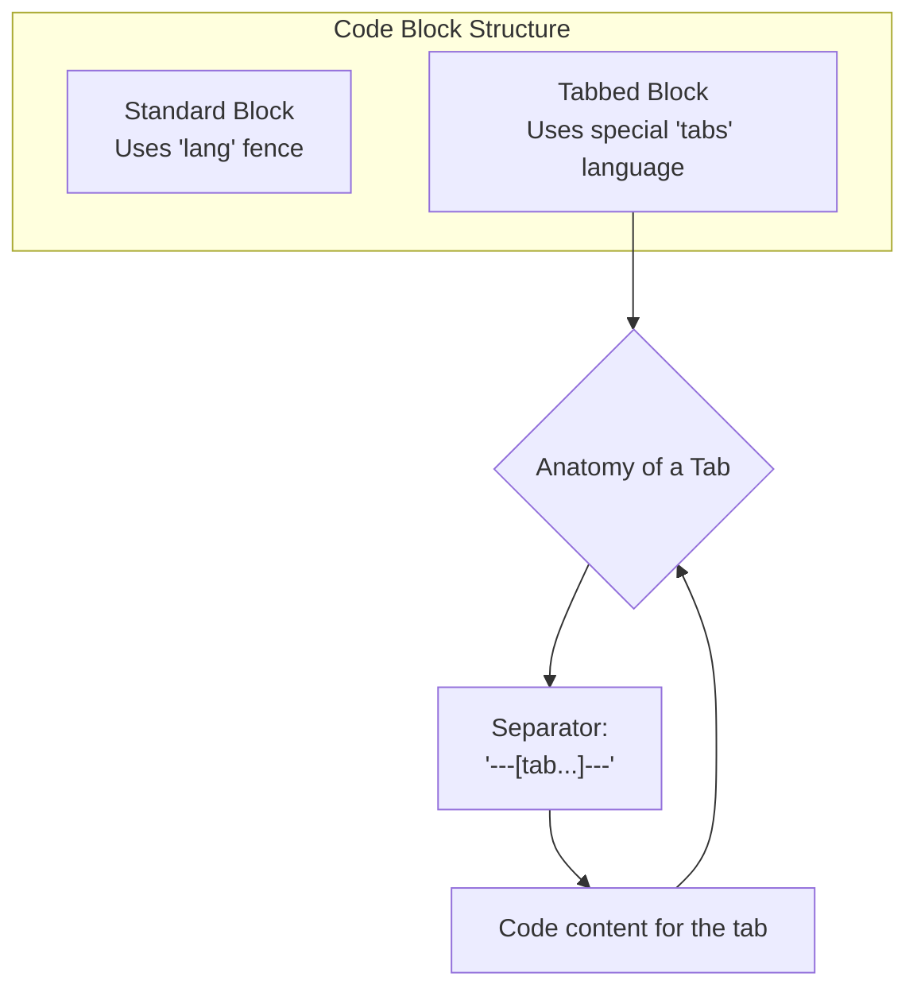

# Code Blocks

The platform offers two main components for displaying code: a standard code block and a tabbed code block.



## Standard Code Block

Create a standard code block using Markdown syntax with the language identifier.

````markdown
```javascript
function greet(name) {
  // A simple comment
  console.log(`Hello, ${name}!`);
}

greet('World');
```
````

**Result:**

```javascript
function greet(name) {
  // A simple comment
  console.log(`Hello, ${name}!`);
}

greet('World');
```

**Features:**
- **macOS-style title bar**: With the language name.
- **Code Copying**: Button to copy the content to the clipboard.
- **Line Numbers**: Option to show/hide line numbers.
- **Fullscreen**: Immersive viewing mode.
- **Zoom**: Hold `Shift` and use the mouse wheel to zoom in on the code.

## Tabbed Code Block

To display the same code snippet in different languages, you can use the tabbed component.

It's created with a `tabs` language code block. Inside, each tab is defined with a special separator.

````markdown
```tabs
---[tab title="JavaScript" lang="js"]---
function greet(name) {
  return `Hello, ${name}!`;
}
console.log(greet('World'));

---[tab title="Python" lang="py"]---
def greet(name):
  return f"Hello, {name}!"

print(greet('World'))

---[tab title="Shell" lang="sh"]---
# This is just an example of how it looks
# with a different language.
echo "Hello, World"
```
````

**Result:**

```tabs
---[tab title="JavaScript" lang="js"]---
function greet(name) {
  return `Hello, ${name}!`;
}
console.log(greet('World'));

---[tab title="Python" lang="py"]---
def greet(name):
  return f"Hello, {name}!"

print(greet('World'))

---[tab title="Shell" lang="sh"]---
# This is just an example of how it looks
# with a different language.
echo "Hello, World"
```

**Features:**
- All the features of the standard code block.
- Clickable tabs to switch between languages.
- The title and language are defined in the `---[tab title="..." lang="..."]---` separator.