# Frontmatter Usage

Every Markdown file in your documentation site can contain a metadata block at the very top of the file, known as "frontmatter." This block is written in YAML and allows you to control various aspects of how the page is displayed and organized.

The frontmatter block must be at the beginning of the file, enclosed by two lines of three dashes (`---`).

## Available Fields

Here is a list of all the fields you can use in the frontmatter:

```mermaid
graph TD
    subgraph "Frontmatter Fields"
        A("--- (Start)") --> B
        B["&#96;title&#96;<br>string, required"] --> C["&#96;author&#96;<br>string, optional"]
        C --> D["&#96;date&#96;<br>string, YYYY-MM-DD"]
        D --> E["&#96;position&#96;<br>number, optional"]
        E --> F["&#96;folder_position&#96;<br>number, optional"]
        F --> G["&#96;hide_title&#96;<br>boolean, optional"]
        G --> H["&#96;hidden&#96;<br>boolean, optional"]
        H --> I("--- (End)")
    end
```



---

### `title`
- **Type:** `string`
- **Required:** Yes
- **Description:** The main title of the page. It will be displayed as the `<h1>` heading at the top of the content and used in the side navigation bar and search results.

**Example:**
```yaml
---
title: "My First Page"
---
```

---

### `author`
- **Type:** `string`
- **Required:** No
- **Description:** The name of the page's author. If provided, it will be displayed below the title along with the date.

**Example:**
```yaml
---
title: "My First Page"
author: "John Doe"
---
```

---

### `date`
- **Type:** `string` (format `YYYY-MM-DD`)
- **Required:** No
- **Description:** The publication date of the document. Pages with a date in the future will not be displayed until that date is reached.

**Example:**
```yaml
---
title: "Launch Announcement"
date: "2024-12-01"
---
```

---

### `position`
- **Type:** `number`
- **Required:** No
- **Description:** A number to control the order of pages within a folder in the side navigation bar. Pages are sorted first by `position` (ascending) and then alphabetically by title.

**Example:**
```yaml
---
title: "Introduction"
position: 1
---
```

---

### `folder_position`
- **Type:** `number`
- **Required:** No
- **Description:** Similar to `position`, but used exclusively in an `index.md` file to determine the sort order of its parent folder in the navigation.

**Example (in `my-folder/index.md`):**
```yaml
---
title: "Folder Title"
folder_position: 2
---
```

---

### `hide_title`
- **Type:** `boolean`
- **Required:** No
- **Description:** If set to `true`, the main `<h1>` title will not be automatically rendered. This is useful for pages that use a `hero-section` component which already includes a prominent title.

**Example:**
```yaml
---
title: "Homepage"
hide_title: true
---
```

---

### `hidden`
- **Type:** `boolean`
- **Required:** No
- **Description:** If set to `true`, the page will be completely hidden from navigation (main and secondary sidebar) and will not be included in search results. The page will still be accessible if navigated to directly via its URL.

**Example:**
```yaml
---
title: "Draft Page"
hidden: true
---
```