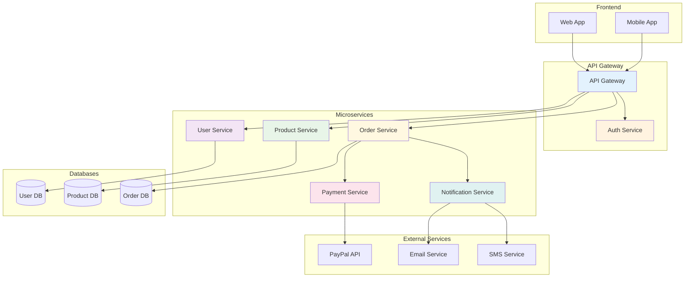
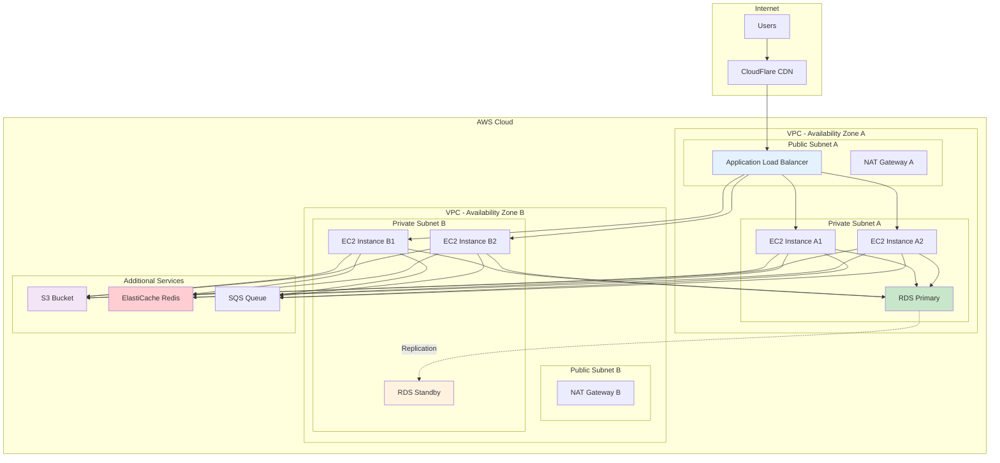
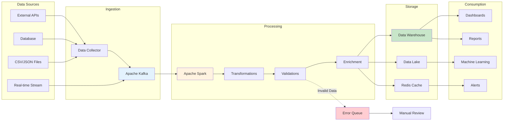
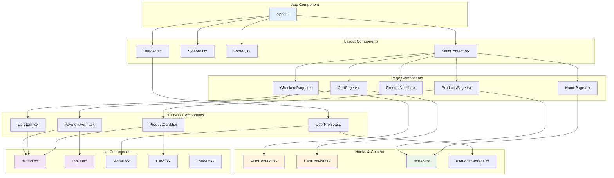

```mermaid
flowchart TB
    subgraph "Frontend"
        WEB[Web App]
        MOBILE[Mobile App]
    end
    
    subgraph "API Gateway"
        GATEWAY[API Gateway]
        AUTH[Auth Service]
    end
    
    subgraph "Microservices"
        USER[User Service]
        PRODUCT[Product Service]
        ORDER[Order Service]
        PAYMENT[Payment Service]
        NOTIFICATION[Notification Service]
    end
    
    subgraph "Databases"
        USERDB[(User DB)]
        PRODUCTDB[(Product DB)]
        ORDERDB[(Order DB)]
    end
    
    subgraph "External Services"
        PAYPAL[PayPal API]
        EMAIL[Email Service]
        SMS[SMS Service]
    end
    
    WEB --> GATEWAY
    MOBILE --> GATEWAY
    
    GATEWAY --> AUTH
    GATEWAY --> USER
    GATEWAY --> PRODUCT
    GATEWAY --> ORDER
    
    USER --> USERDB
    PRODUCT --> PRODUCTDB
    ORDER --> ORDERDB
    
    ORDER --> PAYMENT
    PAYMENT --> PAYPAL
    
    ORDER --> NOTIFICATION
    NOTIFICATION --> EMAIL
    NOTIFICATION --> SMS
    
    style GATEWAY fill:#e3f2fd
    style AUTH fill:#fff3e0
    style USER fill:#f3e5f5
    style PRODUCT fill:#e8f5e8
    style ORDER fill:#fff8e1
    style PAYMENT fill:#fce4ec
    style NOTIFICATION fill:#e0f2f1
```

# Mermaid Diagrams - Specific Use Cases

Practical examples of Mermaid diagrams for real-world situations in software development and technical documentation.

## Enhanced Component Features

Our Mermaid component has been updated with the following improvements:

- **Safe ID generation**: Prevents CSS selector errors with unique and valid identifiers
- **Optimized dynamic loading**: Library loads only when needed, improving performance
- **Complete theme support**: Automatic and smooth adaptation to dark/light mode
- **Robust error handling**: Clear error visualization with informative messages
- **Enhanced responsive design**: Perfect adaptation to different screen sizes
- **More stable rendering**: Elimination of ID conflicts and improved stability

## Microservices Architecture

Diagram showing a microservices system architecture.

````markdown

````

**Result:**


## CI/CD Pipeline Flow

Continuous integration and deployment process.

````markdown

````

**Result:**


```mermaid
flowchart LR
    DEV[Developer] --> COMMIT[Commit Code]
    COMMIT --> TRIGGER[Trigger Pipeline]
    
    subgraph "CI Pipeline"
        BUILD[Build]
        TEST[Run Tests]
        LINT[Code Linting]
        SECURITY[Security Scan]
        PACKAGE[Package App]
    end
    
    subgraph "CD Pipeline"
        DEPLOY_DEV[Deploy to Dev]
        E2E[E2E Tests]
        DEPLOY_STAGING[Deploy to Staging]
        MANUAL[Manual Approval]
        DEPLOY_PROD[Deploy to Production]
    end
    
    TRIGGER --> BUILD
    BUILD --> TEST
    TEST --> LINT
    LINT --> SECURITY
    SECURITY --> PACKAGE
    
    PACKAGE --> DEPLOY_DEV
    DEPLOY_DEV --> E2E
    E2E --> DEPLOY_STAGING
    DEPLOY_STAGING --> MANUAL
    MANUAL --> DEPLOY_PROD
    
    TEST -.->|Fails| NOTIFY_DEV[Notify Developer]
    SECURITY -.->|Vulnerabilities| BLOCK[Block Pipeline]
    E2E -.->|Fails| ROLLBACK[Rollback]
    
    style BUILD fill:#e3f2fd
    style TEST fill:#e8f5e8
    style DEPLOY_PROD fill:#c8e6c9
    style BLOCK fill:#ffcdd2
    style ROLLBACK fill:#fff3e0
```

## Network and Infrastructure Diagram

Cloud infrastructure architecture.

````markdown

````

**Result:**


## Data Processing Pipeline

Real-time data processing pipeline.

````markdown

````

**Result:**


## React Components Diagram

Component structure in a React application.

````markdown

````

**Result:**


## Git Flow Diagram

Git workflow with branches.

````markdown
```mermaid
gitgraph
    commit id: "Initial commit"
    commit id: "Setup project"
    
    branch develop
    checkout develop
    commit id: "Add basic structure"
    commit id: "Configure build"
    
    branch feature/user-auth
    checkout feature/user-auth
    commit id: "Add login form"
    commit id: "Implement auth logic"
    commit id: "Add tests"
    
    checkout develop
    merge feature/user-auth
    commit id: "Update documentation"
    
    branch feature/product-catalog
    checkout feature/product-catalog
    commit id: "Create product model"
    commit id: "Add product list"
    commit id: "Implement search"
    
    checkout develop
    merge feature/product-catalog
    
    branch release/v1.0
    checkout release/v1.0
    commit id: "Prepare release"
    commit id: "Fix minor bugs"
    
    checkout main
    merge release/v1.0
    commit id: "v1.0.0" tag: "v1.0.0"
    
    checkout develop
    merge release/v1.0
    
    branch hotfix/critical-bug
    checkout hotfix/critical-bug
    commit id: "Fix critical bug"
    
    checkout main
    merge hotfix/critical-bug
    commit id: "v1.0.1" tag: "v1.0.1"
    
    checkout develop
    merge hotfix/critical-bug
```
````

**Result:**
```mermaid
gitgraph
    commit id: "Initial commit"
    commit id: "Setup project"
    
    branch develop
    checkout develop
    commit id: "Add basic structure"
    commit id: "Configure build"
    
    branch feature/user-auth
    checkout feature/user-auth
    commit id: "Add login form"
    commit id: "Implement auth logic"
    commit id: "Add tests"
    
    checkout develop
    merge feature/user-auth
    commit id: "Update documentation"
    
    branch feature/product-catalog
    checkout feature/product-catalog
    commit id: "Create product model"
    commit id: "Add product list"
    commit id: "Implement search"
    
    checkout develop
    merge feature/product-catalog
    
    branch release/v1.0
    checkout release/v1.0
    commit id: "Prepare release"
    commit id: "Fix minor bugs"
    
    checkout main
    merge release/v1.0
    commit id: "v1.0.0" tag: "v1.0.0"
    
    checkout develop
    merge release/v1.0
    
    branch hotfix/critical-bug
    checkout hotfix/critical-bug
    commit id: "Fix critical bug"
    
    checkout main
    merge hotfix/critical-bug
    commit id: "v1.0.1" tag: "v1.0.1"
    
    checkout develop
    merge hotfix/critical-bug
```

## Tips for Specific Use Cases

### For Software Architecture
- Use subgraphs to group related components
- Apply consistent colors for different service types
- Include annotations to explain architectural decisions

### For Business Processes
- Keep flow from left to right or top to bottom
- Use different shapes for different activity types
- Include clear decision points

### For Technical Documentation
- Combine different diagram types as needed
- Maintain consistency in naming and styles
- Update diagrams alongside code changes

### Common Troubleshooting

#### "Failed to execute 'querySelector'" Error
This error has been completely resolved in the new component version. Unique and valid IDs are now automatically generated for each diagram.

#### Rendering Issues
- **Incorrect syntax**: Verify your code in [Mermaid Live Editor](https://mermaid.live/)
- **Special characters**: Ensure special characters are properly escaped
- **Unbalanced braces**: Check that all braces `{}` and parentheses `()` are properly closed
- **Inconsistent themes**: The component now automatically handles theme changes

#### Performance Best Practices
- Avoid extremely complex diagrams (more than 50 nodes)
- Break large diagrams into multiple smaller ones
- Use descriptive but concise names for nodes
- Leverage colors and styles to improve readability

### Complementary Tools
- **Mermaid Live Editor**: For quick diagram testing
- **VS Code Extensions**: For real-time preview
- **GitHub Integration**: Diagrams render automatically in README
- **Confluence/Notion**: Native support for Mermaid diagrams
- **Official Documentation**: [Complete syntax guide](https://mermaid-js.github.io/mermaid/)