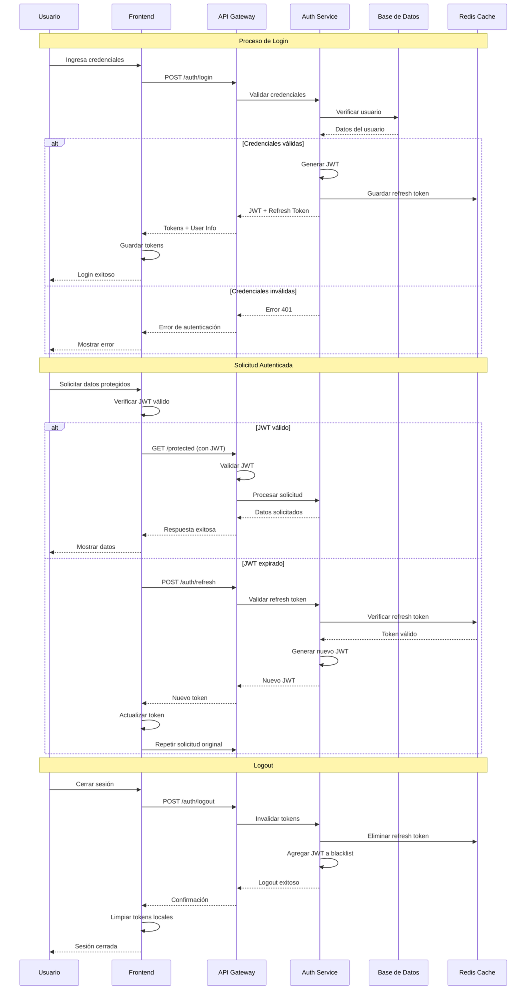
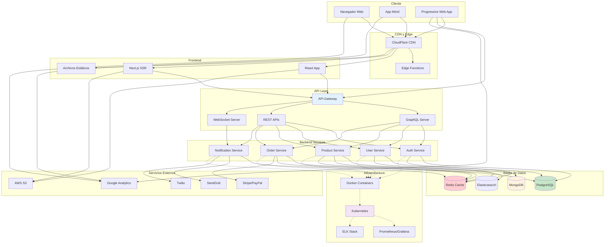
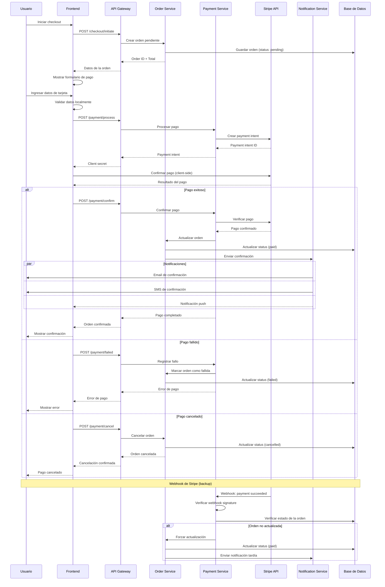
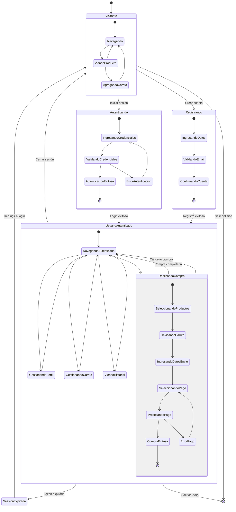

# Diagramas para Desarrollo Web y APIs


Ejemplos específicos de diagramas Mermaid para documentar APIs REST, arquitecturas web y flujos de autenticación.

## API REST - Endpoints y Recursos

Diagrama que muestra la estructura de una API REST.

````markdown
```mermaid
flowchart TD
    subgraph "API REST - E-commerce"
        BASE[/api/v1]
    end
    
    subgraph "Autenticación"
        AUTH[/auth]
        LOGIN[/auth/login]
        REGISTER[/auth/register]
        REFRESH[/auth/refresh]
        LOGOUT[/auth/logout]
    end
    
    subgraph "Usuarios"
        USERS[/users]
        USER_ID[/users/:id]
        USER_PROFILE[/users/:id/profile]
        USER_ORDERS[/users/:id/orders]
    end
    
    subgraph "Productos"
        PRODUCTS[/products]
        PRODUCT_ID[/products/:id]
        PRODUCT_REVIEWS[/products/:id/reviews]
        CATEGORIES[/categories]
        SEARCH[/products/search]
    end
    
    subgraph "Carrito y Órdenes"
        CART[/cart]
        CART_ITEMS[/cart/items]
        ORDERS[/orders]
        ORDER_ID[/orders/:id]
        CHECKOUT[/checkout]
    end
    
    subgraph "Administración"
        ADMIN[/admin]
        ADMIN_USERS[/admin/users]
        ADMIN_PRODUCTS[/admin/products]
        ADMIN_ORDERS[/admin/orders]
        ANALYTICS[/admin/analytics]
    end
    
    BASE --> AUTH
    BASE --> USERS
    BASE --> PRODUCTS
    BASE --> CART
    BASE --> ORDERS
    BASE --> ADMIN
    
    AUTH --> LOGIN
    AUTH --> REGISTER
    AUTH --> REFRESH
    AUTH --> LOGOUT
    
    USERS --> USER_ID
    USER_ID --> USER_PROFILE
    USER_ID --> USER_ORDERS
    
    PRODUCTS --> PRODUCT_ID
    PRODUCTS --> CATEGORIES
    PRODUCTS --> SEARCH
    PRODUCT_ID --> PRODUCT_REVIEWS
    
    CART --> CART_ITEMS
    ORDERS --> ORDER_ID
    ORDERS --> CHECKOUT
    
    ADMIN --> ADMIN_USERS
    ADMIN --> ADMIN_PRODUCTS
    ADMIN --> ADMIN_ORDERS
    ADMIN --> ANALYTICS
    
    style BASE fill:#e3f2fd
    style AUTH fill:#fff3e0
    style USERS fill:#f3e5f5
    style PRODUCTS fill:#e8f5e8
    style CART fill:#fff8e1
    style ORDERS fill:#fce4ec
    style ADMIN fill:#ffebee
```
````

**Resultado:**
```mermaid
flowchart TD
    subgraph "API REST - E-commerce"
        BASE[/api/v1]
    end
    
    subgraph "Autenticación"
        AUTH[/auth]
        LOGIN[/auth/login]
        REGISTER[/auth/register]
        REFRESH[/auth/refresh]
        LOGOUT[/auth/logout]
    end
    
    subgraph "Usuarios"
        USERS[/users]
        USER_ID[/users/:id]
        USER_PROFILE[/users/:id/profile]
        USER_ORDERS[/users/:id/orders]
    end
    
    subgraph "Productos"
        PRODUCTS[/products]
        PRODUCT_ID[/products/:id]
        PRODUCT_REVIEWS[/products/:id/reviews]
        CATEGORIES[/categories]
        SEARCH[/products/search]
    end
    
    subgraph "Carrito y Órdenes"
        CART[/cart]
        CART_ITEMS[/cart/items]
        ORDERS[/orders]
        ORDER_ID[/orders/:id]
        CHECKOUT[/checkout]
    end
    
    subgraph "Administración"
        ADMIN[/admin]
        ADMIN_USERS[/admin/users]
        ADMIN_PRODUCTS[/admin/products]
        ADMIN_ORDERS[/admin/orders]
        ANALYTICS[/admin/analytics]
    end
    
    BASE --> AUTH
    BASE --> USERS
    BASE --> PRODUCTS
    BASE --> CART
    BASE --> ORDERS
    BASE --> ADMIN
    
    AUTH --> LOGIN
    AUTH --> REGISTER
    AUTH --> REFRESH
    AUTH --> LOGOUT
    
    USERS --> USER_ID
    USER_ID --> USER_PROFILE
    USER_ID --> USER_ORDERS
    
    PRODUCTS --> PRODUCT_ID
    PRODUCTS --> CATEGORIES
    PRODUCTS --> SEARCH
    PRODUCT_ID --> PRODUCT_REVIEWS
    
    CART --> CART_ITEMS
    ORDERS --> ORDER_ID
    ORDERS --> CHECKOUT
    
    ADMIN --> ADMIN_USERS
    ADMIN --> ADMIN_PRODUCTS
    ADMIN --> ADMIN_ORDERS
    ADMIN --> ANALYTICS
    
    style BASE fill:#e3f2fd
    style AUTH fill:#fff3e0
    style USERS fill:#f3e5f5
    style PRODUCTS fill:#e8f5e8
    style CART fill:#fff8e1
    style ORDERS fill:#fce4ec
    style ADMIN fill:#ffebee
```

## Flujo de Autenticación JWT

Proceso completo de autenticación con JSON Web Tokens.

````markdown

````

**Resultado:**


## Arquitectura de Aplicación Web Moderna

Estructura completa de una aplicación web con frontend, backend y servicios.

````markdown

````

**Resultado:**


## Flujo de Procesamiento de Pagos

Proceso completo de pago en línea con validaciones y confirmaciones.

````markdown

````

**Resultado:**


## Estados de una Aplicación Web

Diagrama de estados para el ciclo de vida de una sesión de usuario.

````markdown

````

**Resultado:**


## Mejores Prácticas para APIs

### Documentación de Endpoints
- Usa diagramas de flujo para mostrar la estructura de la API
- Incluye códigos de estado HTTP en los diagramas de secuencia
- Documenta los flujos de error y manejo de excepciones

### Autenticación y Seguridad
- Muestra claramente los flujos de autenticación
- Incluye validaciones y puntos de seguridad
- Documenta el manejo de tokens y sesiones

### Arquitectura de Servicios
- Separa claramente las responsabilidades de cada servicio
- Muestra las dependencias entre servicios
- Incluye patrones de comunicación (síncrona/asíncrona)

### Monitoreo y Observabilidad
- Incluye puntos de logging y métricas
- Documenta flujos de error y recuperación
- Muestra integraciones con herramientas de monitoreo