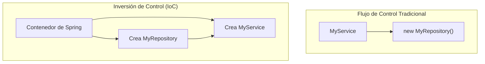

# Sesión 4: Inyección de Dependencias (DI) e Inversión de Control (IoC)

Dos principios fundamentales en Spring son la Inversión de Control y la Inyección de Dependencias.

## Inversión de Control (IoC)

Normalmente, tu código crea y gestiona el ciclo de vida de sus objetos. Con IoC, este control se "invierte": el framework (el contenedor de Spring) es responsable de crear, configurar y gestionar los objetos.



## Inyección de Dependencias (DI)

DI es el patrón a través del cual se implementa la IoC. En lugar de que un objeto cree sus propias dependencias, estas le son "inyectadas" por el contenedor de Spring.

### Tipos de Inyección
- **Inyección por constructor**: La forma recomendada. Las dependencias se proveen a través del constructor.
- **Inyección por setter**: Las dependencias se proveen a través de métodos setter.
- **Inyección por campo**: La más sencilla, pero no recomendada para dependencias obligatorias.

```java
@Service
public class MyService {

    private final MyRepository repository;

    // Inyección por constructor
    @Autowired
    public MyService(MyRepository repository) {
        this.repository = repository;
    }
}
```