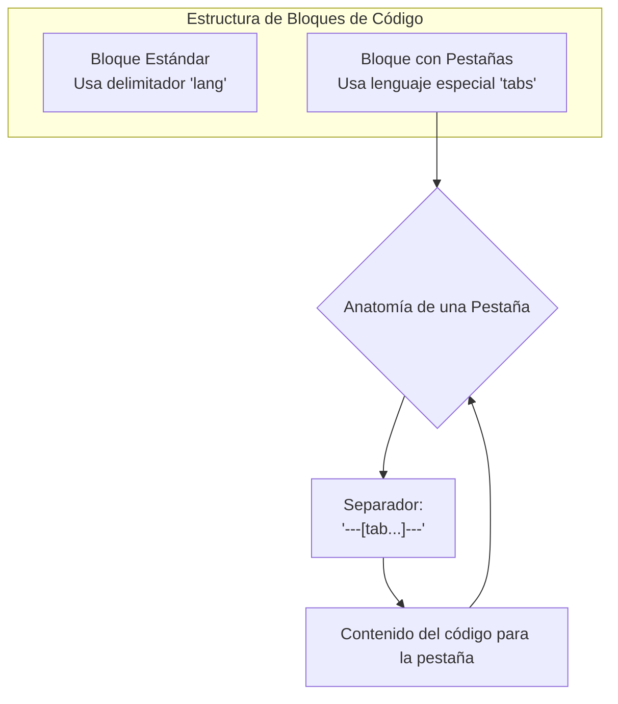

# Bloques de Código

La plataforma ofrece dos componentes principales para mostrar código: un bloque de código estándar y un bloque de código con pestañas.



## Bloque de Código Estándar

Crea un bloque de código estándar usando la sintaxis de Markdown con el identificador de lenguaje.

````markdown
```javascript
function greet(name) {
  // Un simple comentario
  console.log(`Hello, ${name}!`);
}

greet('World');
```
````

**Resultado:**

```javascript
function greet(name) {
  // Un simple comentario
  console.log(`Hello, ${name}!`);
}

greet('World');
```

**Características:**
- **Barra de título estilo macOS**: Con el nombre del lenguaje.
- **Copiado de código**: Botón para copiar el contenido al portapapeles.
- **Números de línea**: Opción para mostrar/ocultar números de línea.
- **Pantalla completa**: Modo de visualización inmersivo.
- **Zoom**: Mantén `Shift` y usa la rueda del ratón para hacer zoom en el código.

## Bloque de Código con Pestañas

Para mostrar el mismo fragmento de código en diferentes lenguajes, puedes usar el componente de pestañas.

Se crea con un bloque de código de lenguaje `tabs`. Dentro, cada pestaña se define con un separador especial.

````markdown
```tabs
---[tab title="JavaScript" lang="js"]---
function greet(name) {
  return `Hello, ${name}!`;
}
console.log(greet('World'));

---[tab title="Python" lang="py"]---
def greet(name):
  return f"Hello, {name}!"

print(greet('World'))

---[tab title="Español" lang="sh"]---
# Esto es solo un ejemplo de cómo se ve
# con un lenguaje diferente.
echo "Hola, Mundo"
```
````

**Resultado:**

```tabs
---[tab title="JavaScript" lang="js"]---
function greet(name) {
  return `Hello, ${name}!`;
}
console.log(greet('World'));

---[tab title="Python" lang="py"]---
def greet(name):
  return f"Hello, {name}!"

print(greet('World'))

---[tab title="Español" lang="sh"]---
# Esto es solo un ejemplo de cómo se ve
# con un lenguaje diferente.
echo "Hola, Mundo"
```

**Características:**
- Todas las características del bloque de código estándar.
- Pestañas clickables para cambiar entre lenguajes.
- El título y el lenguaje se definen en el separador `---[tab title="..." lang="..."]---`.