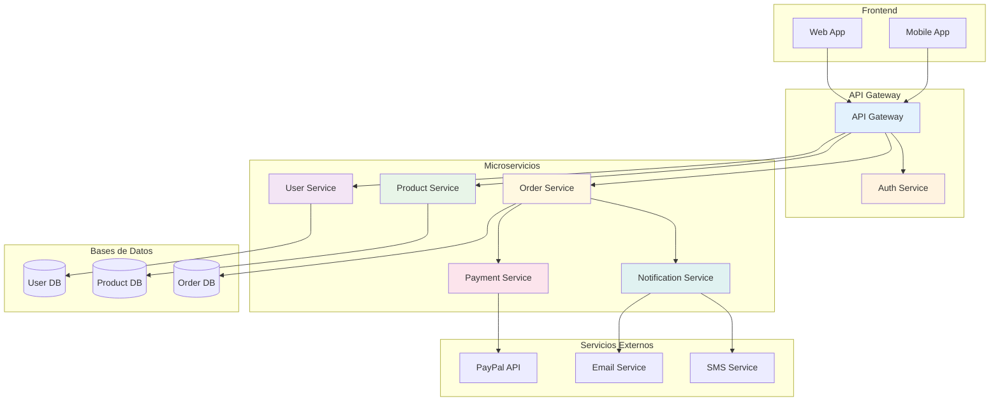
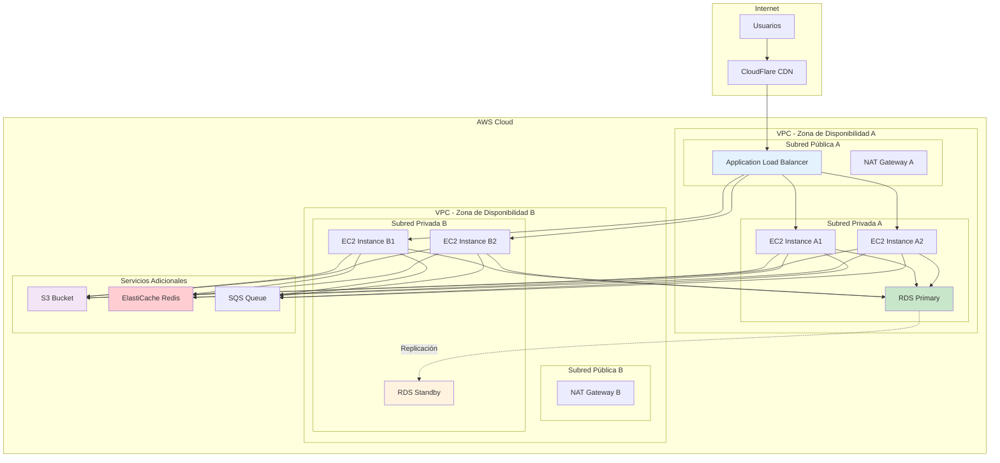
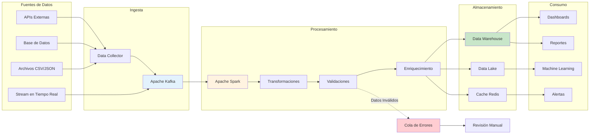
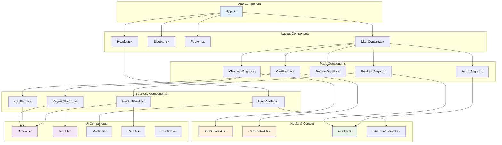

# Diagramas Mermaid - Casos de Uso Específicos

Ejemplos prácticos de diagramas Mermaid para situaciones reales en desarrollo de software y documentación técnica.

## Características del Componente Mejorado

Nuestro componente Mermaid ha sido actualizado con las siguientes mejoras:

- **Generación de IDs seguros**: Evita errores de selector CSS con identificadores únicos y válidos
- **Carga dinámica optimizada**: La librería se carga solo cuando es necesaria, mejorando el rendimiento
- **Soporte completo para temas**: Adaptación automática y fluida al modo oscuro/claro
- **Manejo robusto de errores**: Visualización clara de errores con mensajes informativos
- **Diseño responsive mejorado**: Adaptación perfecta a diferentes tamaños de pantalla
- **Renderizado más estable**: Eliminación de conflictos de ID y mejora en la estabilidad

## Arquitectura de Microservicios

Diagrama que muestra la arquitectura de un sistema de microservicios.

````markdown

````

**Resultado:**


## Flujo de CI/CD

Proceso de integración y despliegue continuo.

````markdown

````

**Resultado:**


```mermaid
flowchart LR
    DEV[Desarrollador] --> COMMIT[Commit Code]
    COMMIT --> TRIGGER[Trigger Pipeline]
    
    subgraph "CI Pipeline"
        BUILD[Build]
        TEST[Run Tests]
        LINT[Code Linting]
        SECURITY[Security Scan]
        PACKAGE[Package App]
    end
    
    subgraph "CD Pipeline"
        DEPLOY_DEV[Deploy to Dev]
        E2E[E2E Tests]
        DEPLOY_STAGING[Deploy to Staging]
        MANUAL[Manual Approval]
        DEPLOY_PROD[Deploy to Production]
    end
    
    TRIGGER --> BUILD
    BUILD --> TEST
    TEST --> LINT
    LINT --> SECURITY
    SECURITY --> PACKAGE
    
    PACKAGE --> DEPLOY_DEV
    DEPLOY_DEV --> E2E
    E2E --> DEPLOY_STAGING
    DEPLOY_STAGING --> MANUAL
    MANUAL --> DEPLOY_PROD
    
    TEST -.->|Falla| NOTIFY_DEV[Notificar Desarrollador]
    SECURITY -.->|Vulnerabilidades| BLOCK[Bloquear Pipeline]
    E2E -.->|Falla| ROLLBACK[Rollback]
    
    style BUILD fill:#e3f2fd
    style TEST fill:#e8f5e8
    style DEPLOY_PROD fill:#c8e6c9
    style BLOCK fill:#ffcdd2
    style ROLLBACK fill:#fff3e0
```

## Diagrama de Red y Infraestructura

Arquitectura de infraestructura en la nube.

````markdown

````

**Resultado:**


## Flujo de Procesamiento de Datos

Pipeline de procesamiento de datos en tiempo real.

````markdown

````

**Resultado:**


## Diagrama de Componentes React

Estructura de componentes en una aplicación React.

````markdown

````

**Resultado:**


## Diagrama de Flujo de Git

Flujo de trabajo con Git y ramas.

````markdown
```mermaid
gitgraph
    commit id: "Initial commit"
    commit id: "Setup project"
    
    branch develop
    checkout develop
    commit id: "Add basic structure"
    commit id: "Configure build"
    
    branch feature/user-auth
    checkout feature/user-auth
    commit id: "Add login form"
    commit id: "Implement auth logic"
    commit id: "Add tests"
    
    checkout develop
    merge feature/user-auth
    commit id: "Update documentation"
    
    branch feature/product-catalog
    checkout feature/product-catalog
    commit id: "Create product model"
    commit id: "Add product list"
    commit id: "Implement search"
    
    checkout develop
    merge feature/product-catalog
    
    branch release/v1.0
    checkout release/v1.0
    commit id: "Prepare release"
    commit id: "Fix minor bugs"
    
    checkout main
    merge release/v1.0
    commit id: "v1.0.0" tag: "v1.0.0"
    
    checkout develop
    merge release/v1.0
    
    branch hotfix/critical-bug
    checkout hotfix/critical-bug
    commit id: "Fix critical bug"
    
    checkout main
    merge hotfix/critical-bug
    commit id: "v1.0.1" tag: "v1.0.1"
    
    checkout develop
    merge hotfix/critical-bug
```
````

**Resultado:**
```mermaid
gitgraph
    commit id: "Initial commit"
    commit id: "Setup project"
    
    branch develop
    checkout develop
    commit id: "Add basic structure"
    commit id: "Configure build"
    
    branch feature/user-auth
    checkout feature/user-auth
    commit id: "Add login form"
    commit id: "Implement auth logic"
    commit id: "Add tests"
    
    checkout develop
    merge feature/user-auth
    commit id: "Update documentation"
    
    branch feature/product-catalog
    checkout feature/product-catalog
    commit id: "Create product model"
    commit id: "Add product list"
    commit id: "Implement search"
    
    checkout develop
    merge feature/product-catalog
    
    branch release/v1.0
    checkout release/v1.0
    commit id: "Prepare release"
    commit id: "Fix minor bugs"
    
    checkout main
    merge release/v1.0
    commit id: "v1.0.0" tag: "v1.0.0"
    
    checkout develop
    merge release/v1.0
    
    branch hotfix/critical-bug
    checkout hotfix/critical-bug
    commit id: "Fix critical bug"
    
    checkout main
    merge hotfix/critical-bug
    commit id: "v1.0.1" tag: "v1.0.1"
    
    checkout develop
    merge hotfix/critical-bug
```

## Consejos para Casos de Uso Específicos

### Para Arquitectura de Software
- Usa subgrafos para agrupar componentes relacionados
- Aplica colores consistentes para diferentes tipos de servicios
- Incluye anotaciones para explicar decisiones arquitectónicas

### Para Procesos de Negocio
- Mantén el flujo de izquierda a derecha o de arriba hacia abajo
- Usa formas diferentes para diferentes tipos de actividades
- Incluye puntos de decisión claros

### Para Documentación Técnica
- Combina diferentes tipos de diagramas según sea necesario
- Mantén la consistencia en nomenclatura y estilos
- Actualiza los diagramas junto con el código

### Solución de Problemas Comunes

#### Error "Failed to execute 'querySelector'"
Este error ha sido completamente resuelto en la nueva versión del componente. Ahora se generan automáticamente IDs únicos y válidos para cada diagrama.

#### Problemas de Renderizado
- **Sintaxis incorrecta**: Verifica tu código en [Mermaid Live Editor](https://mermaid.live/)
- **Caracteres especiales**: Asegúrate de escapar correctamente los caracteres especiales
- **Llaves desbalanceadas**: Revisa que todas las llaves `{}` y paréntesis `()` estén correctamente cerrados
- **Temas inconsistentes**: El componente ahora maneja automáticamente los cambios de tema

#### Mejores Prácticas para Rendimiento
- Evita diagramas extremadamente complejos (más de 50 nodos)
- Divide diagramas grandes en múltiples diagramas más pequeños
- Usa nombres descriptivos pero concisos para los nodos
- Aprovecha los colores y estilos para mejorar la legibilidad

### Herramientas Complementarias
- **Mermaid Live Editor**: Para probar diagramas rápidamente
- **VS Code Extensions**: Para previsualización en tiempo real
- **GitHub Integration**: Los diagramas se renderizan automáticamente en README
- **Confluence/Notion**: Soporte nativo para diagramas Mermaid
- **Documentación oficial**: [Guía completa de sintaxis](https://mermaid-js.github.io/mermaid/)